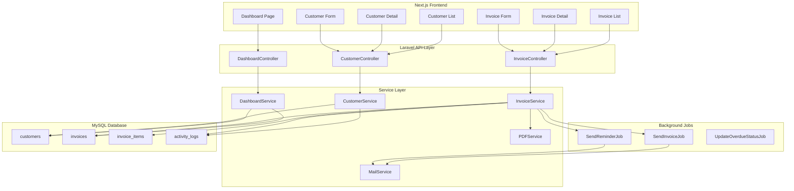
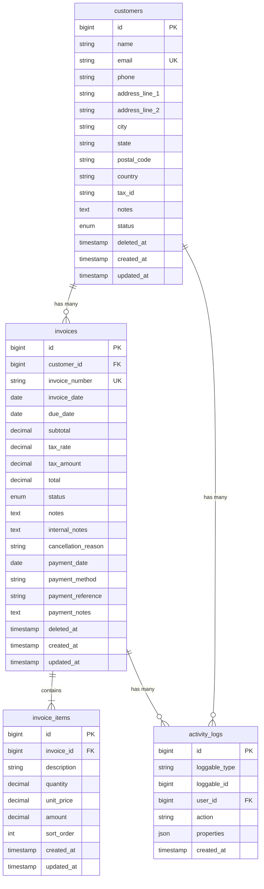

# Technical Design: Accounting Module (Odoo-Inspired)

This document provides the comprehensive technical blueprint for implementing the Accounting Module based on the approved requirements. The system uses **Laravel PHP** for the backend, **Next.js** for the frontend, and **MySQL** for the database.

---

## 1. Architectural Overview

### High-Level Architecture

The Accounting Module follows a **three-tier architecture** with clear separation between presentation, business logic, and data layers:

```
┌─────────────────────────────────────────────────────────────────────┐
│                         CLIENT (Browser)                            │
│                     Next.js App Router (SSR/CSR)                    │
└─────────────────────────────────────────────────────────────────────┘
                                   │
                                   │ HTTPS / REST API
                                   ▼
┌─────────────────────────────────────────────────────────────────────┐
│                       BACKEND (Laravel PHP)                         │
│  ┌─────────────┐  ┌─────────────┐  ┌─────────────┐  ┌────────────┐ │
│  │ Controllers │  │  Services   │  │Repositories │  │   Models   │ │
│  └─────────────┘  └─────────────┘  └─────────────┘  └────────────┘ │
│  ┌─────────────┐  ┌─────────────┐  ┌─────────────┐                 │
│  │    Jobs     │  │   Events    │  │    Mail     │                 │
│  └─────────────┘  └─────────────┘  └─────────────┘                 │
└─────────────────────────────────────────────────────────────────────┘
                                   │
                                   │ Eloquent ORM
                                   ▼
┌─────────────────────────────────────────────────────────────────────┐
│                          DATABASE (MySQL)                           │
│        customers │ invoices │ invoice_items │ activity_logs         │
└─────────────────────────────────────────────────────────────────────┘
```

### Technology Stack

| Layer | Technology | Purpose |
|-------|------------|---------|
| Frontend | Next.js 14+ (App Router) | SSR/CSR with component-based UI |
| State Management | React Query + Context | Server state & app state |
| Routing | Next.js App Router | File-based routing with layouts |
| UI Components | Custom + CSS Modules | Responsive design system |
| HTTP Client | Fetch API / Server Actions | API communication |
| Backend | Laravel 11 | RESTful API, business logic |
| Authentication | Laravel Sanctum | SPA token authentication |
| Queue | Laravel Queue (Redis) | Async email processing |
| PDF Generation | DomPDF / Snappy | Invoice PDF creation |
| Email | Laravel Mail | SMTP email delivery |
| Database | MySQL 8.0+ | Relational data storage |
| Scheduler | Laravel Task Scheduling | Overdue status updates |

---

## 2. Data Flow Diagram



---

## 3. Database Schema

### Entity Relationship Diagram



### SQL DDL Statements

```sql
-- Customers Table
CREATE TABLE customers (
    id BIGINT UNSIGNED AUTO_INCREMENT PRIMARY KEY,
    name VARCHAR(100) NOT NULL,
    email VARCHAR(255) NOT NULL UNIQUE,
    phone VARCHAR(50) NULL,
    address_line_1 VARCHAR(255) NULL,
    address_line_2 VARCHAR(255) NULL,
    city VARCHAR(100) NULL,
    state VARCHAR(100) NULL,
    postal_code VARCHAR(20) NULL,
    country VARCHAR(100) NULL,
    tax_id VARCHAR(50) NULL,
    notes TEXT NULL,
    status ENUM('active', 'inactive') DEFAULT 'active',
    deleted_at TIMESTAMP NULL,
    created_at TIMESTAMP DEFAULT CURRENT_TIMESTAMP,
    updated_at TIMESTAMP DEFAULT CURRENT_TIMESTAMP ON UPDATE CURRENT_TIMESTAMP,
    INDEX idx_customers_status (status),
    INDEX idx_customers_deleted_at (deleted_at)
) ENGINE=InnoDB DEFAULT CHARSET=utf8mb4 COLLATE=utf8mb4_unicode_ci;

-- Invoices Table
CREATE TABLE invoices (
    id BIGINT UNSIGNED AUTO_INCREMENT PRIMARY KEY,
    customer_id BIGINT UNSIGNED NOT NULL,
    invoice_number VARCHAR(50) NOT NULL UNIQUE,
    invoice_date DATE NOT NULL,
    due_date DATE NOT NULL,
    subtotal DECIMAL(15, 2) DEFAULT 0.00,
    tax_rate DECIMAL(5, 2) DEFAULT 0.00,
    tax_amount DECIMAL(15, 2) DEFAULT 0.00,
    total DECIMAL(15, 2) DEFAULT 0.00,
    status ENUM('draft', 'sent', 'paid', 'overdue', 'cancelled') DEFAULT 'draft',
    notes TEXT NULL,
    internal_notes TEXT NULL,
    cancellation_reason VARCHAR(200) NULL,
    payment_date DATE NULL,
    payment_method ENUM('cash', 'bank_transfer', 'credit_card', 'other') NULL,
    payment_reference VARCHAR(255) NULL,
    payment_notes TEXT NULL,
    deleted_at TIMESTAMP NULL,
    created_at TIMESTAMP DEFAULT CURRENT_TIMESTAMP,
    updated_at TIMESTAMP DEFAULT CURRENT_TIMESTAMP ON UPDATE CURRENT_TIMESTAMP,
    FOREIGN KEY (customer_id) REFERENCES customers(id) ON DELETE CASCADE,
    INDEX idx_invoices_customer_id (customer_id),
    INDEX idx_invoices_status (status),
    INDEX idx_invoices_due_date (due_date),
    INDEX idx_invoices_deleted_at (deleted_at)
) ENGINE=InnoDB DEFAULT CHARSET=utf8mb4 COLLATE=utf8mb4_unicode_ci;

-- Invoice Items Table
CREATE TABLE invoice_items (
    id BIGINT UNSIGNED AUTO_INCREMENT PRIMARY KEY,
    invoice_id BIGINT UNSIGNED NOT NULL,
    description VARCHAR(200) NOT NULL,
    quantity DECIMAL(10, 2) NOT NULL,
    unit_price DECIMAL(15, 2) NOT NULL,
    amount DECIMAL(15, 2) NOT NULL,
    sort_order INT DEFAULT 0,
    created_at TIMESTAMP DEFAULT CURRENT_TIMESTAMP,
    updated_at TIMESTAMP DEFAULT CURRENT_TIMESTAMP ON UPDATE CURRENT_TIMESTAMP,
    FOREIGN KEY (invoice_id) REFERENCES invoices(id) ON DELETE CASCADE,
    INDEX idx_invoice_items_invoice_id (invoice_id)
) ENGINE=InnoDB DEFAULT CHARSET=utf8mb4 COLLATE=utf8mb4_unicode_ci;

-- Activity Logs Table (Polymorphic)
CREATE TABLE activity_logs (
    id BIGINT UNSIGNED AUTO_INCREMENT PRIMARY KEY,
    loggable_type VARCHAR(255) NOT NULL,
    loggable_id BIGINT UNSIGNED NOT NULL,
    user_id BIGINT UNSIGNED NULL,
    action VARCHAR(50) NOT NULL,
    properties JSON NULL,
    created_at TIMESTAMP DEFAULT CURRENT_TIMESTAMP,
    INDEX idx_activity_logs_loggable (loggable_type, loggable_id),
    INDEX idx_activity_logs_user_id (user_id),
    INDEX idx_activity_logs_created_at (created_at)
) ENGINE=InnoDB DEFAULT CHARSET=utf8mb4 COLLATE=utf8mb4_unicode_ci;

-- Invoice Number Sequence Table (for sequential generation)
CREATE TABLE invoice_sequences (
    id BIGINT UNSIGNED AUTO_INCREMENT PRIMARY KEY,
    year INT NOT NULL,
    last_number INT DEFAULT 0,
    created_at TIMESTAMP DEFAULT CURRENT_TIMESTAMP,
    updated_at TIMESTAMP DEFAULT CURRENT_TIMESTAMP ON UPDATE CURRENT_TIMESTAMP,
    UNIQUE KEY uk_invoice_sequences_year (year)
) ENGINE=InnoDB DEFAULT CHARSET=utf8mb4 COLLATE=utf8mb4_unicode_ci;
```

---

## 4. API Endpoint Definitions

### Base URL
```
/api/v1
```

### Authentication
All endpoints require authentication via Laravel Sanctum bearer token.

---

### Dashboard Endpoints

#### GET /dashboard/summary
Returns dashboard summary statistics.

**Response (200):**
```json
{
  "data": {
    "total_receivables": 15000.00,
    "total_customers": 42,
    "invoices_due_this_month": {
      "count": 8,
      "amount": 5200.00
    },
    "recent_activity": [
      {
        "id": 1,
        "action": "invoice_sent",
        "description": "Invoice INV-2026-0015 sent to Acme Corp",
        "created_at": "2026-02-05T10:30:00Z"
      }
    ]
  }
}
```

---

### Customer Endpoints

#### GET /customers
Returns paginated list of customers.

**Query Parameters:**
| Parameter | Type | Description |
|-----------|------|-------------|
| page | int | Page number (default: 1) |
| per_page | int | Items per page (default: 25, max: 100) |
| search | string | Search by name, email, or phone |
| status | string | Filter by status: active, inactive |
| sort_by | string | Sort field: name, email, created_at |
| sort_order | string | asc or desc |

**Response (200):**
```json
{
  "data": [
    {
      "id": 1,
      "name": "Acme Corporation",
      "email": "billing@acme.com",
      "phone": "+1-555-0100",
      "total_receivable": 2500.00,
      "status": "active"
    }
  ],
  "meta": {
    "current_page": 1,
    "last_page": 5,
    "per_page": 25,
    "total": 120
  }
}
```

#### POST /customers
Creates a new customer.

**Request Body:**
```json
{
  "name": "Acme Corporation",
  "email": "billing@acme.com",
  "phone": "+1-555-0100",
  "address_line_1": "123 Main St",
  "address_line_2": "Suite 100",
  "city": "New York",
  "state": "NY",
  "postal_code": "10001",
  "country": "United States",
  "tax_id": "12-3456789",
  "notes": "Important client, handle with care"
}
```

**Response (201):**
```json
{
  "data": {
    "id": 1,
    "name": "Acme Corporation",
    "email": "billing@acme.com",
    "phone": "+1-555-0100",
    "address_line_1": "123 Main St",
    "address_line_2": "Suite 100",
    "city": "New York",
    "state": "NY",
    "postal_code": "10001",
    "country": "United States",
    "tax_id": "12-3456789",
    "notes": "Important client, handle with care",
    "status": "active",
    "total_receivable": 0.00,
    "created_at": "2026-02-05T10:30:00Z",
    "updated_at": "2026-02-05T10:30:00Z"
  },
  "message": "Customer created successfully"
}
```

**Error Response (422):**
```json
{
  "message": "The given data was invalid.",
  "errors": {
    "email": ["A customer with this email already exists."],
    "name": ["The name field is required."]
  }
}
```

#### GET /customers/{id}
Returns customer details with invoice summary.

**Response (200):**
```json
{
  "data": {
    "id": 1,
    "name": "Acme Corporation",
    "email": "billing@acme.com",
    "phone": "+1-555-0100",
    "address_line_1": "123 Main St",
    "address_line_2": "Suite 100",
    "city": "New York",
    "state": "NY",
    "postal_code": "10001",
    "country": "United States",
    "tax_id": "12-3456789",
    "notes": "Important client",
    "status": "active",
    "total_receivable": 2500.00,
    "invoices": [
      {
        "id": 1,
        "invoice_number": "INV-2026-0001",
        "invoice_date": "2026-01-15",
        "due_date": "2026-02-15",
        "total": 1500.00,
        "status": "sent"
      }
    ],
    "created_at": "2026-02-05T10:30:00Z",
    "updated_at": "2026-02-05T10:30:00Z"
  }
}
```

#### PUT /customers/{id}
Updates an existing customer.

**Request Body:** Same as POST (all fields optional except required validation)

**Response (200):**
```json
{
  "data": { /* Updated customer object */ },
  "message": "Customer updated successfully"
}
```

#### DELETE /customers/{id}
Soft-deletes a customer and associated invoices.

**Response (200):**
```json
{
  "message": "Customer deleted successfully"
}
```

---

### Invoice Endpoints

#### GET /invoices
Returns paginated list of invoices.

**Query Parameters:**
| Parameter | Type | Description |
|-----------|------|-------------|
| page | int | Page number |
| per_page | int | Items per page (default: 25) |
| search | string | Search by invoice number or customer name |
| status | string | Filter: draft, sent, paid, overdue, cancelled |
| customer_id | int | Filter by customer |
| date_from | date | Invoice date from |
| date_to | date | Invoice date to |
| due_date_from | date | Due date from |
| due_date_to | date | Due date to |

**Response (200):**
```json
{
  "data": [
    {
      "id": 1,
      "invoice_number": "INV-2026-0001",
      "customer": {
        "id": 1,
        "name": "Acme Corporation"
      },
      "invoice_date": "2026-01-15",
      "due_date": "2026-02-15",
      "total": 1500.00,
      "status": "sent"
    }
  ],
  "meta": {
    "current_page": 1,
    "last_page": 3,
    "per_page": 25,
    "total": 75
  }
}
```

#### POST /invoices
Creates a new invoice.

**Request Body:**
```json
{
  "customer_id": 1,
  "invoice_date": "2026-02-05",
  "due_date": "2026-03-05",
  "tax_rate": 10.00,
  "notes": "Thank you for your business",
  "internal_notes": "Approved by manager",
  "items": [
    {
      "description": "Web Development Services",
      "quantity": 40,
      "unit_price": 75.00
    },
    {
      "description": "Hosting (Monthly)",
      "quantity": 1,
      "unit_price": 50.00
    }
  ],
  "send_immediately": false
}
```

**Response (201):**
```json
{
  "data": {
    "id": 1,
    "invoice_number": "INV-2026-0001",
    "customer_id": 1,
    "invoice_date": "2026-02-05",
    "due_date": "2026-03-05",
    "subtotal": 3050.00,
    "tax_rate": 10.00,
    "tax_amount": 305.00,
    "total": 3355.00,
    "status": "draft",
    "notes": "Thank you for your business",
    "internal_notes": "Approved by manager",
    "items": [
      {
        "id": 1,
        "description": "Web Development Services",
        "quantity": 40,
        "unit_price": 75.00,
        "amount": 3000.00
      },
      {
        "id": 2,
        "description": "Hosting (Monthly)",
        "quantity": 1,
        "unit_price": 50.00,
        "amount": 50.00
      }
    ],
    "created_at": "2026-02-05T10:30:00Z"
  },
  "message": "Invoice created successfully"
}
```

#### GET /invoices/{id}
Returns invoice details.

**Response (200):**
```json
{
  "data": {
    "id": 1,
    "invoice_number": "INV-2026-0001",
    "customer": {
      "id": 1,
      "name": "Acme Corporation",
      "email": "billing@acme.com",
      "address_line_1": "123 Main St",
      "city": "New York",
      "state": "NY",
      "postal_code": "10001",
      "country": "United States"
    },
    "invoice_date": "2026-02-05",
    "due_date": "2026-03-05",
    "subtotal": 3050.00,
    "tax_rate": 10.00,
    "tax_amount": 305.00,
    "total": 3355.00,
    "status": "sent",
    "notes": "Thank you for your business",
    "internal_notes": "Approved by manager",
    "payment_date": null,
    "payment_method": null,
    "payment_reference": null,
    "items": [ /* invoice items */ ],
    "available_actions": ["mark_as_paid", "resend", "cancel"],
    "created_at": "2026-02-05T10:30:00Z",
    "updated_at": "2026-02-05T10:30:00Z"
  }
}
```

#### PUT /invoices/{id}
Updates a draft invoice.

**Response (200):** Updated invoice object

**Error Response (403):**
```json
{
  "message": "Only draft invoices can be edited."
}
```

#### DELETE /invoices/{id}
Deletes a draft invoice.

**Response (200):**
```json
{
  "message": "Invoice deleted successfully"
}
```

**Error Response (403):**
```json
{
  "message": "Only draft invoices can be deleted. Use cancel for sent invoices."
}
```

#### POST /invoices/{id}/send
Sends invoice to customer via email.

**Request Body:**
```json
{
  "recipient_email": "billing@acme.com",
  "subject": "Invoice INV-2026-0001 from Your Company",
  "message": "Please find attached your invoice."
}
```

**Response (200):**
```json
{
  "message": "Invoice sent successfully"
}
```

#### POST /invoices/{id}/resend
Resends a previously sent invoice.

**Request/Response:** Same as /send

#### POST /invoices/{id}/send-reminder
Sends payment reminder for overdue invoice.

**Request Body:**
```json
{
  "recipient_email": "billing@acme.com",
  "subject": "Payment Reminder: Invoice INV-2026-0001",
  "message": "This is a friendly reminder that your payment is overdue."
}
```

**Response (200):**
```json
{
  "message": "Payment reminder sent successfully"
}
```

#### POST /invoices/{id}/mark-as-paid
Marks invoice as paid.

**Request Body:**
```json
{
  "payment_date": "2026-02-10",
  "payment_method": "bank_transfer",
  "payment_reference": "TXN-123456",
  "notes": "Payment received via wire transfer"
}
```

**Response (200):**
```json
{
  "data": { /* Updated invoice with status: paid */ },
  "message": "Invoice marked as paid"
}
```

#### POST /invoices/{id}/cancel
Cancels an invoice.

**Request Body:**
```json
{
  "cancellation_reason": "Customer requested cancellation due to service change"
}
```

**Response (200):**
```json
{
  "data": { /* Updated invoice with status: cancelled */ },
  "message": "Invoice cancelled successfully"
}
```

#### GET /invoices/{id}/pdf
Downloads invoice as PDF.

**Response (200):** Binary PDF file with headers:
```
Content-Type: application/pdf
Content-Disposition: attachment; filename="INV-2026-0001.pdf"
```

---

## 5. Component & Interface Definitions

### Backend (Laravel)

#### Models

```php
// app/Models/Customer.php
class Customer extends Model
{
    use SoftDeletes, HasActivityLog;
    
    protected $fillable = [
        'name', 'email', 'phone', 'address_line_1', 'address_line_2',
        'city', 'state', 'postal_code', 'country', 'tax_id', 'notes', 'status'
    ];
    
    protected $casts = [
        'status' => CustomerStatus::class, // Enum
    ];
    
    public function invoices(): HasMany;
    public function getTotalReceivableAttribute(): float;
}

// app/Models/Invoice.php
class Invoice extends Model
{
    use SoftDeletes, HasActivityLog;
    
    protected $fillable = [
        'customer_id', 'invoice_number', 'invoice_date', 'due_date',
        'subtotal', 'tax_rate', 'tax_amount', 'total', 'status',
        'notes', 'internal_notes', 'cancellation_reason',
        'payment_date', 'payment_method', 'payment_reference', 'payment_notes'
    ];
    
    protected $casts = [
        'invoice_date' => 'date',
        'due_date' => 'date',
        'payment_date' => 'date',
        'status' => InvoiceStatus::class, // Enum
        'payment_method' => PaymentMethod::class, // Enum
    ];
    
    public function customer(): BelongsTo;
    public function items(): HasMany;
    public function calculateTotals(): void;
    public function isEditable(): bool;
    public function isDeletable(): bool;
    public function getAvailableActionsAttribute(): array;
}

// app/Models/InvoiceItem.php
class InvoiceItem extends Model
{
    protected $fillable = ['invoice_id', 'description', 'quantity', 'unit_price', 'amount', 'sort_order'];
    
    public function invoice(): BelongsTo;
    
    protected static function booted(): void
    {
        static::saving(function ($item) {
            $item->amount = $item->quantity * $item->unit_price;
        });
    }
}
```

#### Enums

```php
// app/Enums/CustomerStatus.php
enum CustomerStatus: string
{
    case Active = 'active';
    case Inactive = 'inactive';
}

// app/Enums/InvoiceStatus.php
enum InvoiceStatus: string
{
    case Draft = 'draft';
    case Sent = 'sent';
    case Paid = 'paid';
    case Overdue = 'overdue';
    case Cancelled = 'cancelled';
}

// app/Enums/PaymentMethod.php
enum PaymentMethod: string
{
    case Cash = 'cash';
    case BankTransfer = 'bank_transfer';
    case CreditCard = 'credit_card';
    case Other = 'other';
}
```

#### Services

```php
// app/Services/CustomerService.php
class CustomerService
{
    public function list(CustomerListRequest $request): LengthAwarePaginator;
    public function create(array $data): Customer;
    public function update(Customer $customer, array $data): Customer;
    public function delete(Customer $customer): void;
    public function calculateReceivable(Customer $customer): float;
}

// app/Services/InvoiceService.php
class InvoiceService
{
    public function list(InvoiceListRequest $request): LengthAwarePaginator;
    public function create(array $data): Invoice;
    public function update(Invoice $invoice, array $data): Invoice;
    public function delete(Invoice $invoice): void;
    public function send(Invoice $invoice, SendInvoiceRequest $request): void;
    public function sendReminder(Invoice $invoice, SendReminderRequest $request): void;
    public function markAsPaid(Invoice $invoice, MarkAsPaidRequest $request): Invoice;
    public function cancel(Invoice $invoice, CancelInvoiceRequest $request): Invoice;
    public function generateInvoiceNumber(): string;
}

// app/Services/DashboardService.php
class DashboardService
{
    public function getSummary(): array;
    public function getTotalReceivables(): float;
    public function getTotalCustomers(): int;
    public function getInvoicesDueThisMonth(): array;
    public function getRecentActivity(int $limit = 5): Collection;
}

// app/Services/PDFService.php
class PDFService
{
    public function generateInvoicePDF(Invoice $invoice): string; // Returns file path
}
```

#### Jobs

```php
// app/Jobs/SendInvoiceEmailJob.php
class SendInvoiceEmailJob implements ShouldQueue
{
    public function __construct(
        public Invoice $invoice,
        public string $recipientEmail,
        public string $subject,
        public string $message
    ) {}
    
    public function handle(PDFService $pdfService, Mailer $mailer): void;
}

// app/Jobs/UpdateOverdueInvoicesJob.php
class UpdateOverdueInvoicesJob implements ShouldQueue
{
    public function handle(): void
    {
        Invoice::where('status', InvoiceStatus::Sent)
            ->where('due_date', '<', now()->startOfDay())
            ->update(['status' => InvoiceStatus::Overdue]);
    }
}
```

---

### Frontend (Next.js)

#### Directory Structure

```
app/
├── (auth)/
│   ├── login/
│   │   └── page.tsx
│   └── layout.tsx
├── (dashboard)/
│   ├── layout.tsx             # Main dashboard layout with sidebar
│   ├── page.tsx               # Dashboard home page
│   ├── customers/
│   │   ├── page.tsx           # Customer list page
│   │   ├── new/
│   │   │   └── page.tsx       # Create customer page
│   │   └── [id]/
│   │       ├── page.tsx       # Customer detail page
│   │       └── edit/
│   │           └── page.tsx   # Edit customer page
│   └── invoices/
│       ├── page.tsx           # Invoice list page
│       ├── new/
│       │   └── page.tsx       # Create invoice page
│       └── [id]/
│           ├── page.tsx       # Invoice detail page
│           └── edit/
│               └── page.tsx   # Edit invoice page (draft only)
├── api/                       # API route handlers (optional BFF)
│   └── [...]/
├── layout.tsx                 # Root layout
└── globals.css

components/
├── ui/
│   ├── Button/
│   ├── Input/
│   ├── Select/
│   ├── Table/
│   ├── Pagination/
│   ├── Modal/
│   ├── EmptyState/
│   └── Loading/
├── customers/
│   ├── CustomerList.tsx
│   ├── CustomerDetail.tsx
│   ├── CustomerForm.tsx
│   └── CustomerCard.tsx
├── invoices/
│   ├── InvoiceList.tsx
│   ├── InvoiceDetail.tsx
│   ├── InvoiceForm.tsx
│   ├── InvoiceLineItems.tsx
│   ├── InvoiceStatusBadge.tsx
│   └── SendInvoiceModal.tsx
└── dashboard/
    ├── SummaryCard.tsx
    ├── QuickActions.tsx
    └── RecentActivity.tsx

lib/
├── api/
│   ├── client.ts              # Fetch wrapper with auth
│   ├── customers.ts           # Customer API calls
│   ├── invoices.ts            # Invoice API calls
│   └── dashboard.ts           # Dashboard API calls
├── hooks/
│   ├── useCustomers.ts        # React Query hooks for customers
│   ├── useInvoices.ts         # React Query hooks for invoices
│   └── useDashboard.ts        # React Query hooks for dashboard
└── utils/
    ├── formatters.ts          # Currency, date formatting
    └── validators.ts          # Form validation helpers

types/
├── customer.ts
├── invoice.ts
└── api.ts

styles/
├── variables.css
└── components/
```

#### TypeScript Interfaces

```typescript
// types/customer.ts
export interface Customer {
  id: number;
  name: string;
  email: string;
  phone: string | null;
  address_line_1: string | null;
  address_line_2: string | null;
  city: string | null;
  state: string | null;
  postal_code: string | null;
  country: string | null;
  tax_id: string | null;
  notes: string | null;
  status: 'active' | 'inactive';
  total_receivable: number;
  invoices?: Invoice[]; // Added for detail view
  created_at: string;
  updated_at: string;
}

export interface CustomerListItem {
  id: number;
  name: string;
  email: string;
  phone: string | null;
  total_receivable: number;
  status: 'active' | 'inactive';
}

export interface CustomerFormData {
  name: string;
  email: string;
  phone?: string;
  address_line_1?: string;
  address_line_2?: string;
  city?: string;
  state?: string;
  postal_code?: string;
  country?: string;
  tax_id?: string;
  notes?: string;
}

// types/invoice.ts
export type InvoiceStatus = 'draft' | 'sent' | 'paid' | 'overdue' | 'cancelled';
export type PaymentMethod = 'cash' | 'bank_transfer' | 'credit_card' | 'other';

export interface InvoiceItem {
  id?: number;
  description: string;
  quantity: number;
  unit_price: number;
  amount: number;
}

export interface Invoice {
  id: number;
  invoice_number: string;
  customer_id: number;
  customer: Customer;
  invoice_date: string;
  due_date: string;
  subtotal: number;
  tax_rate: number;
  tax_amount: number;
  total: number;
  status: InvoiceStatus;
  notes: string | null;
  internal_notes: string | null;
  cancellation_reason: string | null;
  payment_date: string | null;
  payment_method: PaymentMethod | null;
  payment_reference: string | null;
  items: InvoiceItem[];
  available_actions: string[];
  created_at: string;
  updated_at: string;
}

export interface InvoiceFormData {
  customer_id: number;
  invoice_date: string;
  due_date: string;
  tax_rate: number;
  notes?: string;
  internal_notes?: string;
  items: Omit<InvoiceItem, 'id' | 'amount'>[];
  send_immediately: boolean;
}

// types/api.ts
export interface PaginatedResponse<T> {
  data: T[];
  meta: {
    current_page: number;
    last_page: number;
    per_page: number;
    total: number;
  };
}

export interface ApiError {
  message: string;
  errors?: Record<string, string[]>;
}
```

#### React Query Hooks

```typescript
// lib/hooks/useCustomers.ts
'use client';

import { useQuery, useMutation, useQueryClient } from '@tanstack/react-query';
import * as customersApi from '@/lib/api/customers';

export function useCustomers(params: CustomerListParams) {
  return useQuery({
    queryKey: ['customers', params],
    queryFn: () => customersApi.list(params),
  });
}

export function useCustomer(id: number) {
  return useQuery({
    queryKey: ['customers', id],
    queryFn: () => customersApi.get(id),
  });
}

export function useCreateCustomer() {
  const queryClient = useQueryClient();
  return useMutation({
    mutationFn: customersApi.create,
    onSuccess: () => {
      queryClient.invalidateQueries({ queryKey: ['customers'] });
    },
  });
}

export function useUpdateCustomer() {
  const queryClient = useQueryClient();
  return useMutation({
    mutationFn: ({ id, data }: { id: number; data: CustomerFormData }) => 
      customersApi.update(id, data),
    onSuccess: (_, { id }) => {
      queryClient.invalidateQueries({ queryKey: ['customers'] });
      queryClient.invalidateQueries({ queryKey: ['customers', id] });
    },
  });
}

export function useDeleteCustomer() {
  const queryClient = useQueryClient();
  return useMutation({
    mutationFn: customersApi.remove,
    onSuccess: () => {
      queryClient.invalidateQueries({ queryKey: ['customers'] });
    },
  });
}
```

---

## 6. Security Considerations

### Authentication & Authorization

| Concern | Mitigation |
|---------|------------|
| API Authentication | Laravel Sanctum SPA authentication with httpOnly cookies |
| CSRF Protection | Sanctum ensures CSRF token validation for all state-changing requests |
| Session Management | Secure session configuration with proper timeout and regeneration |

### Data Protection

| Concern | Mitigation |
|---------|------------|
| Sensitive Data at Rest | Encrypt `tax_id` field using Laravel's built-in encryption |
| Data Transmission | Enforce HTTPS for all API communication |
| SQL Injection | Eloquent ORM with parameterized queries |
| XSS Prevention | Next.js/React's default escaping + CSP headers |

### Input Validation

| Concern | Mitigation |
|---------|------------|
| Server-side Validation | Laravel Form Request classes with comprehensive rules |
| Client-side Validation | React Hook Form with Zod validation |
| File Upload (PDF) | Generated server-side only, no user uploads in initial scope |

### Audit & Logging

| Concern | Mitigation |
|---------|------------|
| Action Logging | All CRUD operations logged to `activity_logs` table |
| User Attribution | User ID recorded with each action |
| Sensitive Data Masking | Tax ID masked in activity logs |

### Rate Limiting

```php
// routes/api.php
Route::middleware(['auth:sanctum', 'throttle:api'])->group(function () {
    // API routes with rate limiting: 60 requests/minute by default
});

// For email sending endpoints
Route::middleware(['throttle:10,1'])->group(function () {
    Route::post('/invoices/{id}/send', [InvoiceController::class, 'send']);
    Route::post('/invoices/{id}/send-reminder', [InvoiceController::class, 'sendReminder']);
});
```

---

## 7. Test Strategy

### Unit Tests (PHPUnit)

**Location:** `tests/Unit/`

| Test Suite | Coverage |
|------------|----------|
| `CustomerServiceTest` | Customer CRUD operations, receivable calculation |
| `InvoiceServiceTest` | Invoice CRUD, status transitions, number generation |
| `InvoiceCalculationTest` | Subtotal, tax, and total calculations |
| `PDFServiceTest` | PDF generation for invoices |

**Run Command:**
```bash
php artisan test --testsuite=Unit
```

### Feature/Integration Tests (PHPUnit)

**Location:** `tests/Feature/`

| Test Suite | Coverage |
|------------|----------|
| `CustomerApiTest` | All customer API endpoints |
| `InvoiceApiTest` | All invoice API endpoints |
| `DashboardApiTest` | Dashboard summary endpoint |
| `InvoiceEmailTest` | Email sending with queue mocking |
| `OverdueJobTest` | Scheduled job for overdue status updates |

**Run Command:**
```bash
php artisan test --testsuite=Feature
```

### Frontend Tests (Jest + React Testing Library)

**Location:** `__tests__/`

| Test Suite | Coverage |
|------------|----------|
| `CustomerForm.test.tsx` | Form validation, submission |
| `InvoiceForm.test.tsx` | Line item calculations, form validation |
| `CustomerList.test.tsx` | List rendering, search, pagination |
| `InvoiceList.test.tsx` | List rendering, filtering, status badges |

**Run Command:**
```bash
npm run test
```

### End-to-End Tests (Playwright)

**Location:** `e2e/`

| Test Suite | Coverage |
|------------|----------|
| `customer-crud.spec.ts` | Full customer lifecycle |
| `invoice-crud.spec.ts` | Full invoice lifecycle |
| `dashboard.spec.ts` | Dashboard navigation and quick actions |
| `responsive.spec.ts` | Mobile and tablet layouts |

**Run Command:**
```bash
npx playwright test
```

### Manual Verification Checklist

> [!IMPORTANT]
> The following manual tests should be performed before release.

#### Customer Module
- [ ] Create customer with all fields → Verify data saved correctly
- [ ] Create customer with duplicate email → Verify error message shown
- [ ] Search customers by name/email/phone → Verify filtering works
- [ ] Edit customer → Verify changes persist
- [ ] Delete customer with invoices → Verify warning shown, soft-delete works

#### Invoice Module
- [ ] Create invoice with multiple line items → Verify calculations correct
- [ ] Save as draft → Verify status is "Draft"
- [ ] Edit draft invoice → Verify all fields editable
- [ ] Send invoice → Verify email received with PDF attachment
- [ ] Mark as paid → Verify status updates, receivable decreases
- [ ] Cancel invoice → Verify status updates, reason recorded
- [ ] Test overdue detection → Set past due date, run `php artisan schedule:run`

#### Dashboard
- [ ] View dashboard with data → Verify all cards show correct values
- [ ] View dashboard empty state → Verify onboarding message appears
- [ ] Click summary cards → Verify navigation to correct lists
- [ ] Use quick actions → Verify forms open correctly

#### Responsive Design
- [ ] Test on desktop (>1024px) → Full sidebar visible
- [ ] Test on tablet (768-1024px) → Collapsible navigation
- [ ] Test on mobile (<768px) → Bottom/hamburger navigation

---

## 8. File Structure Summary

### Backend (Laravel)

```
app/
├── Enums/
│   ├── CustomerStatus.php
│   ├── InvoiceStatus.php
│   └── PaymentMethod.php
├── Http/
│   ├── Controllers/
│   │   ├── DashboardController.php
│   │   ├── CustomerController.php
│   │   └── InvoiceController.php
│   ├── Requests/
│   │   ├── Customer/
│   │   │   ├── StoreCustomerRequest.php
│   │   │   └── UpdateCustomerRequest.php
│   │   └── Invoice/
│   │       ├── StoreInvoiceRequest.php
│   │       ├── UpdateInvoiceRequest.php
│   │       ├── SendInvoiceRequest.php
│   │       ├── MarkAsPaidRequest.php
│   │       └── CancelInvoiceRequest.php
│   └── Resources/
│       ├── CustomerResource.php
│       ├── CustomerCollection.php
│       ├── InvoiceResource.php
│       └── InvoiceCollection.php
├── Jobs/
│   ├── SendInvoiceEmailJob.php
│   ├── SendReminderEmailJob.php
│   └── UpdateOverdueInvoicesJob.php
├── Mail/
│   ├── InvoiceMail.php
│   └── PaymentReminderMail.php
├── Models/
│   ├── Customer.php
│   ├── Invoice.php
│   ├── InvoiceItem.php
│   └── ActivityLog.php
├── Services/
│   ├── CustomerService.php
│   ├── InvoiceService.php
│   ├── DashboardService.php
│   └── PDFService.php
└── Traits/
    └── HasActivityLog.php

database/
├── migrations/
│   ├── create_customers_table.php
│   ├── create_invoices_table.php
│   ├── create_invoice_items_table.php
│   ├── create_activity_logs_table.php
│   └── create_invoice_sequences_table.php
└── seeders/
    ├── CustomerSeeder.php
    └── InvoiceSeeder.php

routes/
└── api.php

resources/
└── views/
    ├── pdf/
    │   └── invoice.blade.php
    └── emails/
        ├── invoice.blade.php
        └── payment-reminder.blade.php

tests/
├── Unit/
│   ├── CustomerServiceTest.php
│   ├── InvoiceServiceTest.php
│   └── InvoiceCalculationTest.php
└── Feature/
    ├── CustomerApiTest.php
    ├── InvoiceApiTest.php
    └── DashboardApiTest.php
```

### Frontend (Next.js)

```
[NEW] app/
├── (auth)/
│   ├── login/page.tsx
│   └── layout.tsx
├── (dashboard)/
│   ├── layout.tsx
│   ├── page.tsx
│   ├── customers/
│   │   ├── page.tsx
│   │   ├── new/page.tsx
│   │   └── [id]/
│   │       ├── page.tsx
│   │       └── edit/page.tsx
│   └── invoices/
│       ├── page.tsx
│       ├── new/page.tsx
│       └── [id]/
│           ├── page.tsx
│           └── edit/page.tsx
├── layout.tsx
└── globals.css

[NEW] components/
├── ui/
│   ├── Button.tsx
│   ├── Input.tsx
│   ├── Select.tsx
│   ├── Table.tsx
│   ├── Pagination.tsx
│   ├── Modal.tsx
│   ├── EmptyState.tsx
│   └── Loading.tsx
├── customers/
│   ├── CustomerList.tsx
│   ├── CustomerDetail.tsx
│   ├── CustomerForm.tsx
│   └── CustomerCard.tsx
├── invoices/
│   ├── InvoiceList.tsx
│   ├── InvoiceDetail.tsx
│   ├── InvoiceForm.tsx
│   ├── InvoiceLineItems.tsx
│   ├── InvoiceStatusBadge.tsx
│   └── SendInvoiceModal.tsx
└── dashboard/
    ├── SummaryCard.tsx
    ├── QuickActions.tsx
    └── RecentActivity.tsx

[NEW] lib/
├── api/
│   ├── client.ts
│   ├── customers.ts
│   ├── invoices.ts
│   └── dashboard.ts
├── hooks/
│   ├── useCustomers.ts
│   ├── useInvoices.ts
│   └── useDashboard.ts
└── utils/
    ├── formatters.ts
    └── validators.ts

[NEW] types/
├── customer.ts
├── invoice.ts
└── api.ts
```

---

## 9. Implementation Phases

### Phase 1: Foundation
- Database migrations and models
- Basic API structure with authentication
- Next.js project setup with App Router

### Phase 2: Customer Module
- Customer CRUD API endpoints
- Customer list, detail, and form pages
- Search and pagination

### Phase 3: Invoice Module
- Invoice CRUD API endpoints
- Invoice list, detail, and form pages
- Line item management and calculations

### Phase 4: Email & PDF
- PDF generation service
- Email templates
- Send invoice and reminder functionality

### Phase 5: Dashboard & Polish
- Dashboard summary API
- Dashboard page with summary cards
- Quick actions
- Responsive design adjustments

### Phase 6: Testing & QA
- Unit and integration tests
- E2E test suite
- Manual QA verification
