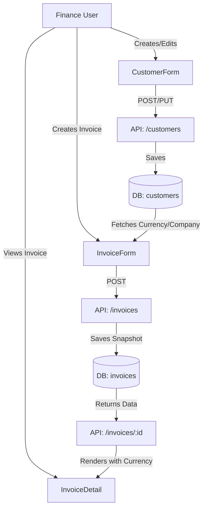

**Technical Design: Customer Currency & Company Details**

**1. Architectural Overview**
The feature involves determining and persisting currency and company details at the customer level and propagating them to invoices.
- **Backend:**
  - Update `customers` table to store `currency` and `company_name`.
  - Update `invoices` table to store `currency` (snapshot at creation time).
  - Update `Customer` and `Invoice` models and API resources.
- **Frontend:**
  - Update `CustomerForm` to include currency selection and company name input.
  - Update `InvoiceDetail` and `InvoicePDF` (if applicable) to display company name and format amounts using the specific currency.
  - Update `formatCurrency` utility to support dynamic currencies.

**2. Data Flow Diagram**


**3. Component & Interface Definitions**

**Frontend Interfaces (`types/index.ts`)**
```typescript
export interface Customer {
    // ... existing fields
    currency: string; // e.g., 'USD', 'IDR'
    company_name?: string;
}

export interface Invoice {
    // ... existing fields
    currency: string; // Stored currency code
}

export type CurrencyCode = 'IDR' | 'USD' | 'SGD' | 'AUD'; // Extendable
```

**Frontend Components**
- **`CustomerForm`**: Add `Select` for `currency` (default 'IDR') and `Input` for `company_name`.
- **`InvoiceDetail`**: Update `formatCurrency` calls to pass `invoice.currency`. display `invoice.customer.company_name` in the "Bill To" section if available.

**Utility**
- **`formatCurrency(amount: number, currency: string = 'IDR')`**: Updates the existing helper to format based on the passed currency code.

**4. API Endpoint Definitions**

**Create/Update Customer**
- **Path:** `POST /api/customers` / `PUT /api/customers/{id}`
- **Request Body:**
  ```json
  {
      "name": "John Doe",
      "company_name": "Acme Corp", // New, Optional
      "currency": "USD", // New, Default 'IDR'
      // ... other existing fields
  }
  ```

**Create Invoice**
- **Path:** `POST /api/invoices`
- **Logic:** When creating an invoice, the backend automatically populates `invoice.currency` from the associated `customer.currency`.

**5. Database Schema Changes**

**Migration: `add_currency_and_company_to_customers`**
```php
Schema::table('customers', function (Blueprint $table) {
    $table->string('currency', 3)->default('IDR')->after('email');
    $table->string('company_name')->nullable()->after('name');
});
```

**Migration: `add_currency_to_invoices`**
```php
Schema::table('invoices', function (Blueprint $table) {
    $table->string('currency', 3)->default('IDR')->after('customer_id');
});
```

**6. Security Considerations**
- **Input Validation:** Ensure `currency` is a valid 3-letter ISO code (or restricted to a specific allowlist like 'IDR', 'USD'). Ensure `company_name` is sanitized.
- **Authorization:** Only authorized users (acting as Finance/Admin) can modify these fields.

**7. Test Strategy**
- **Unit Tests (Backend):**
  - Test that `Customer` creates with valid currency and company name.
  - Test validation rules for currency code.
  - Test that creating an invoice copies the customer's currency.
- **Component Tests (Frontend):**
  - Verify `CustomerForm` renders new fields.
  - Verify `InvoiceDetail` displays the correct currency symbol and company name.
- **E2E Tests:**
  - Create a customer with 'USD' and a Company Name.
  - Create an invoice for that customer.
  - Verify the invoice list/detail shows the USD symbol and the company name.
