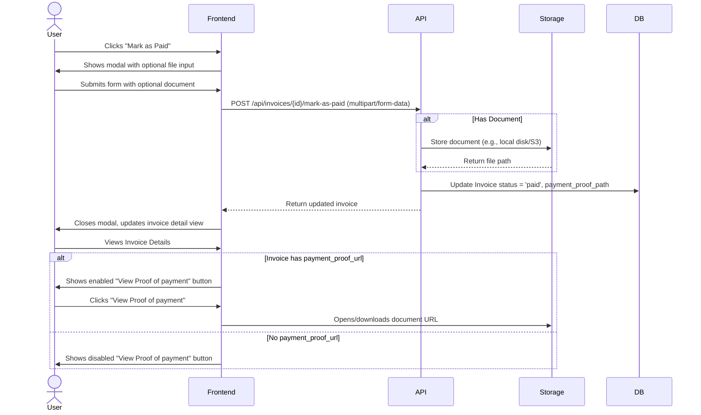

# Technical Design: Invoice Payment Proof

## 1. Architectural Overview
The "Invoice Payment Proof" feature allows Finance Users to optionally upload a document (PDF, JPG, PNG) when marking an invoice as paid. This document will be stored securely on the backend, and its path will be saved in the `invoices` table. The frontend modal for "Mark as Paid" will be updated to include a file input. The `InvoiceDetail` page will be updated to replace the "View Receipt" button with a "View Proof of payment" button that links to the uploaded document, and will be disabled if no document exists.

## 2. Data Flow Diagram


## 3. Component & Interface Definitions

### Frontend (Next.js)
- **`components/invoices/MarkAsPaidModal.tsx`**: Add an optional `<input type="file" />` (or equivalent shadcn UI component) for uploading the proof document. The submission logic will need to be refactored to use `FormData` since it will be sending multipart data instead of a standard JSON payload.
- **`components/invoices/InvoiceDetail.tsx`**: Update the "View Receipt" button:
  - Change button text to "View Proof of payment".
  - Add `disabled={!invoice.payment_proof_url}`.
  - Implement the `onClick` handler to open the URL in a new tab if it exists.
- **Types (`types/invoice.ts` or equivalent)**: Add `payment_proof_url?: string;` to the `Invoice` interface so TypeScript properly recognizes the new property.

### Backend (Laravel)
- **`App\Models\Invoice`**: Add `payment_proof_path` to the `$fillable` array. 
- **`App\Http\Requests\Invoice\MarkAsPaidRequest`**: Add validation for `payment_proof`. It must be nullable, a valid file type (`mimes:pdf,jpg,jpeg,png`), and adhere to a suitable maximum size limit (e.g., `max:5120` for 5MB).
- **`App\Services\InvoiceService`**: In the `markAsPaid` method, intercept the uploaded file from `$data` array (if present). Use Laravel's Storage facade to save it into a public directory (e.g., `proofs`), and append the resulting file path to the `$data` before passing it to `update`.
- **`App\Http\Resources\InvoiceResource`**: Modify the resource mapping to include a full URL to the file, e.g., `'payment_proof_url' => $this->payment_proof_path ? Storage::url($this->payment_proof_path) : null`.

## 4. API Endpoint Definitions

**Mark Invoice as Paid**
- **Method & Path:** `POST /api/invoices/{invoice}/mark-as-paid`
- **Content-Type:** `multipart/form-data`
- **Request Body:**
  - `payment_date`: string (date, required)
  - `payment_method`: string (optional)
  - `payment_reference`: string (optional)
  - `notes`: string (optional)
  - `payment_proof`: file (optional, format: PDF, JPG, PNG)
- **Success Response (200):**
  ```json
  {
    "data": {
      "id": 1,
      "status": "paid",
      "payment_proof_url": "https://<domain>/storage/proofs/12345.pdf",
      // ...other existing invoice fields
    },
    "message": "Invoice marked as paid"
  }
  ```

## 5. Database Schema Changes

A new Laravel migration is required to alter the `invoices` table to accommodate the file path.

```php
Schema::table('invoices', function (Blueprint $table) {
    $table->string('payment_proof_path')->nullable()->after('payment_notes');
});
```

## 6. Security Considerations
- **File Validation:** The backend must strictly validate the uploaded file type (MIME types: `application/pdf`, `image/jpeg`, `image/png`) and enforce a maximum file size (e.g., 5MB) to prevent malicious batch uploads.
- **Storage Accessibility:** Uploaded proofs will be stored in a directory accessible via the application's storage configuration (e.g., the `public` disk linking to `storage/app/public/proofs`). 
- **Authorization:** Only authorized roles (such as Finance Users or Admins) should be permitted to call the `markAsPaid` endpoint or view the proof documents. Existing Sanctum authentication rules on the `/api/invoices` routes will gracefully handle access control.

## 7. Test Strategy

### Automated Tests
- **Backend Unit/Feature Tests:**
  - `InvoiceControllerTest`: Test `POST /invoices/{id}/mark-as-paid` with a mock file upload. Verify the file is stored correctly in the simulated storage and that the database receives the path.
  - `InvoiceControllerTest`: Test the same endpoint without a file upload to ensure backward compatibility and optionality logic operates flawlessly.
  - `MarkAsPaidRequestTest`: Test validation rules (ensure invalid file types or excessive file sizes are rejected).

### Manual Verification
1. Create a draft invoice and send it to transition the status to 'sent'.
2. Click the "Mark as Paid" action. Let the modal populate.
3. Verify the modal now includes an option to upload a "Proof of Payment" file. Let field limitations reflect standard image documents and PDFs.
4. Execute the form submission without uploading a file. Validate that the invoice correctly transitions to 'paid' and that the "View Proof of payment" button in the Invoice Detail view is disabled (greyed out).
5. Open another draft/sent invoice and repeat the same steps, this time successfully uploading a valid document. Validate the form successfully completes the transaction.
6. Verify the "View Proof of payment" UI component is enabled. Test interactivity by clicking it and ensuring the newly uploaded file opens or correctly triggers a browser download.
