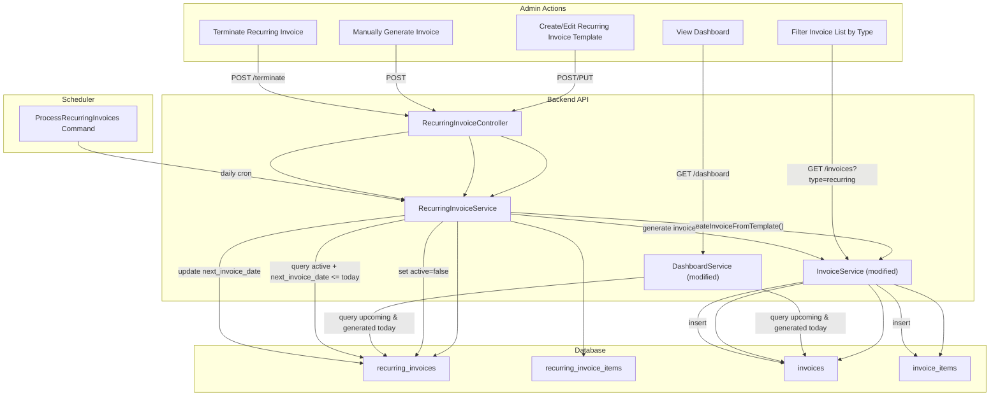

# Technical Design: Recurring Invoice System

## 1. Architectural Overview

This feature introduces a **Recurring Invoice** subsystem alongside the existing one-off invoice workflow. The core concept is a new `RecurringInvoice` entity (model + table) that defines a recurring schedule and line-item template per customer. A Laravel scheduled command runs daily to auto-generate invoices from active templates. The design intentionally avoids renaming the existing `InvoiceTemplate` model (which manages visual layout components), and instead introduces a separate `RecurringInvoice` model to represent recurring schedule templates.

### Key Architectural Decisions

| Decision | Rationale |
|----------|-----------|
| New `RecurringInvoice` model (not reusing `InvoiceTemplate`) | The existing `InvoiceTemplate` manages form layout components (toggleable sections). Recurring invoice templates are a fundamentally different concept with their own lifecycle, status, and line items. |
| `recurring_invoice_items` table for template line items | Keeps template items separate from generated `invoice_items`, allowing template edits without affecting already-generated invoices. |
| `type` enum column on `invoices` table | Clean classification of `manual` vs `recurring` invoices at the database level. |
| `due_date` nullable on `invoices` | Supports templates with no due-date offset; backward-compatible since the column was already non-null but the Resource already handles null safely. |
| `RecurringInvoice` → `Invoice` relationship via `recurring_invoice_id` FK | Generated invoices link back to their source template for traceability. |
| Laravel `schedule:run` Artisan command | Uses Laravel's built-in scheduler, consistent with the existing tech stack. |

### System Context

```
┌──────────────────────────────────────────────────────────┐
│                     Frontend (Next.js 16)                │
│  ┌──────────────┐ ┌──────────────┐ ┌──────────────────┐  │
│  │  Dashboard    │ │ Invoice List │ │ Customer Detail  │  │
│  │ + Recurring   │ │ + Type Col   │ │ + Recurring Tab  │  │
│  │   Widget      │ │ + Type Filter│ │ + CRUD Form      │  │
│  └──────────────┘ └──────────────┘ └──────────────────┘  │
└──────────────────────────┬───────────────────────────────┘
                           │ REST API (JSON)
┌──────────────────────────▼───────────────────────────────┐
│                    Backend (Laravel 12)                   │
│  ┌───────────────────┐  ┌────────────────────────────┐   │
│  │RecurringInvoice   │  │ ProcessRecurringInvoices    │   │
│  │  Controller       │  │ (Artisan Command)           │   │
│  │  Service          │  │ runs daily via scheduler    │   │
│  │  Resources        │  └────────────────────────────┘   │
│  └───────────────────┘                                   │
│  ┌───────────────────┐  ┌────────────────────────────┐   │
│  │ Invoice (modified)│  │ Dashboard (modified)        │   │
│  │ + type field      │  │ + recurring summary         │   │
│  │ + recurring FK    │  │ + upcoming list             │   │
│  └───────────────────┘  └────────────────────────────┘   │
└──────────────────────────┬───────────────────────────────┘
                           │
┌──────────────────────────▼───────────────────────────────┐
│                    Database (SQLite/MySQL)                │
│  recurring_invoices  │  recurring_invoice_items           │
│  invoices (+type, +recurring_invoice_id, due_date null)  │
└──────────────────────────────────────────────────────────┘
```

---

## 2. Data Flow Diagram



---

## 3. Database Schema Changes

### 3.1 New Table: `recurring_invoices`

```sql
CREATE TABLE recurring_invoices (
    id              BIGINT UNSIGNED AUTO_INCREMENT PRIMARY KEY,
    customer_id     BIGINT UNSIGNED NOT NULL,
    name            VARCHAR(255) NOT NULL,
    recurrence_type ENUM('monthly','weekly','bi_weekly','tri_weekly','manual','counted') NOT NULL,
    interval_value  INT UNSIGNED NULL,           -- for counted: e.g. every N
    interval_unit   ENUM('days','weeks','months') NULL, -- for counted: unit
    total_count     INT UNSIGNED NULL,           -- for counted: total invoices to generate
    generated_count INT UNSIGNED NOT NULL DEFAULT 0,
    tax_rate        DECIMAL(5,2) NOT NULL DEFAULT 0.00,
    due_date_offset INT UNSIGNED NULL,           -- days after invoice_date; NULL = no due date
    start_date      DATE NOT NULL,
    next_invoice_date DATE NULL,
    active          BOOLEAN NOT NULL DEFAULT TRUE,
    notes           TEXT NULL,
    created_at      TIMESTAMP NULL,
    updated_at      TIMESTAMP NULL,

    FOREIGN KEY (customer_id) REFERENCES customers(id) ON DELETE CASCADE,
    INDEX idx_active_next_date (active, next_invoice_date),
    INDEX idx_customer (customer_id)
);
```

### 3.2 New Table: `recurring_invoice_items`

```sql
CREATE TABLE recurring_invoice_items (
    id                    BIGINT UNSIGNED AUTO_INCREMENT PRIMARY KEY,
    recurring_invoice_id  BIGINT UNSIGNED NOT NULL,
    description           VARCHAR(200) NOT NULL,
    quantity              DECIMAL(10,2) NOT NULL,
    unit_price            DECIMAL(15,2) NOT NULL,
    sort_order            INT UNSIGNED NOT NULL DEFAULT 0,
    created_at            TIMESTAMP NULL,
    updated_at            TIMESTAMP NULL,

    FOREIGN KEY (recurring_invoice_id) REFERENCES recurring_invoices(id) ON DELETE CASCADE
);
```

### 3.3 Modify Table: `invoices`

```sql
-- Add type column
ALTER TABLE invoices ADD COLUMN type ENUM('manual','recurring') NOT NULL DEFAULT 'manual' AFTER currency;

-- Add FK to source template
ALTER TABLE invoices ADD COLUMN recurring_invoice_id BIGINT UNSIGNED NULL AFTER type;
ALTER TABLE invoices ADD FOREIGN KEY (recurring_invoice_id) REFERENCES recurring_invoices(id) ON DELETE SET NULL;

-- Make due_date nullable
ALTER TABLE invoices MODIFY COLUMN due_date DATE NULL;

-- Add indexes
ALTER TABLE invoices ADD INDEX idx_type (type);
ALTER TABLE invoices ADD INDEX idx_recurring_invoice_id (recurring_invoice_id);
```

#### Laravel Migration

```php
// Migration: add_type_and_recurring_fields_to_invoices_table
Schema::table('invoices', function (Blueprint $table) {
    $table->enum('type', ['manual', 'recurring'])->default('manual')->after('currency');
    $table->foreignId('recurring_invoice_id')->nullable()->after('type')
          ->constrained('recurring_invoices')->nullOnDelete();
    $table->date('due_date')->nullable()->change();

    $table->index('type');
    $table->index('recurring_invoice_id');
});
```

---

## 4. Component & Interface Definitions

### 4.1 Backend — New Enum

#### [NEW] `app/Enums/RecurrenceType.php`

```php
<?php
namespace App\Enums;

enum RecurrenceType: string
{
    case Monthly   = 'monthly';
    case Weekly    = 'weekly';
    case BiWeekly  = 'bi_weekly';
    case TriWeekly = 'tri_weekly';
    case Manual    = 'manual';
    case Counted   = 'counted';
}
```

#### [NEW] `app/Enums/InvoiceType.php`

```php
<?php
namespace App\Enums;

enum InvoiceType: string
{
    case Manual    = 'manual';
    case Recurring = 'recurring';
}
```

#### [NEW] `app/Enums/RecurringInvoiceStatus.php`

```php
<?php
namespace App\Enums;

// Computed status — NOT stored in DB
enum RecurringInvoiceStatus: string
{
    case Pending    = 'pending';
    case InProgress = 'in_progress';
    case Done       = 'done';
    case Terminated = 'terminated';
}
```

### 4.2 Backend — New Models

#### [NEW] `app/Models/RecurringInvoice.php`

```php
<?php
namespace App\Models;

use App\Enums\RecurrenceType;
use App\Enums\RecurringInvoiceStatus;
use Illuminate\Database\Eloquent\Model;
use Illuminate\Database\Eloquent\Relations\BelongsTo;
use Illuminate\Database\Eloquent\Relations\HasMany;

class RecurringInvoice extends Model
{
    protected $fillable = [
        'customer_id', 'name', 'recurrence_type',
        'interval_value', 'interval_unit', 'total_count',
        'generated_count', 'tax_rate', 'due_date_offset',
        'start_date', 'next_invoice_date', 'active', 'notes',
    ];

    protected $casts = [
        'recurrence_type'   => RecurrenceType::class,
        'start_date'        => 'date',
        'next_invoice_date' => 'date',
        'tax_rate'          => 'decimal:2',
        'active'            => 'boolean',
    ];

    protected $appends = ['status'];

    public function customer(): BelongsTo
    {
        return $this->belongsTo(Customer::class);
    }

    public function items(): HasMany
    {
        return $this->hasMany(RecurringInvoiceItem::class)->orderBy('sort_order');
    }

    public function invoices(): HasMany
    {
        return $this->hasMany(Invoice::class);
    }

    /**
     * Computed status accessor (Req 1, AC 11-12)
     */
    public function getStatusAttribute(): RecurringInvoiceStatus
    {
        if (!$this->active && $this->generated_count > 0) {
            // Terminated: deactivated before cycle completed
            if ($this->recurrence_type === RecurrenceType::Counted
                && $this->generated_count >= $this->total_count) {
                return RecurringInvoiceStatus::Done;
            }
            return RecurringInvoiceStatus::Terminated;
        }

        if (!$this->active && $this->generated_count === 0) {
            return RecurringInvoiceStatus::Terminated;
        }

        if ($this->start_date->isFuture()) {
            return RecurringInvoiceStatus::Pending;
        }

        if ($this->recurrence_type === RecurrenceType::Counted
            && $this->generated_count >= $this->total_count) {
            return RecurringInvoiceStatus::Done;
        }

        return RecurringInvoiceStatus::InProgress;
    }
}
```

#### [NEW] `app/Models/RecurringInvoiceItem.php`

```php
<?php
namespace App\Models;

use Illuminate\Database\Eloquent\Model;
use Illuminate\Database\Eloquent\Relations\BelongsTo;

class RecurringInvoiceItem extends Model
{
    protected $fillable = [
        'recurring_invoice_id', 'description', 'quantity', 'unit_price', 'sort_order',
    ];

    protected $casts = [
        'quantity'   => 'decimal:2',
        'unit_price' => 'decimal:2',
    ];

    public function recurringInvoice(): BelongsTo
    {
        return $this->belongsTo(RecurringInvoice::class);
    }
}
```

### 4.3 Backend — Modified Model: `Invoice`

Add to `$fillable`: `'type'`, `'recurring_invoice_id'`

Add to `$casts`: `'type' => InvoiceType::class`

Add relationship:

```php
public function recurringInvoice(): BelongsTo
{
    return $this->belongsTo(RecurringInvoice::class);
}
```

Add scope:

```php
public function scopeByType($query, string $type)
{
    return $query->where('type', $type);
}
```

### 4.4 Backend — Modified Model: `Customer`

Add relationship:

```php
public function recurringInvoices(): HasMany
{
    return $this->hasMany(RecurringInvoice::class);
}
```

### 4.5 Backend — New Service

#### [NEW] `app/Services/RecurringInvoiceService.php`

Key methods:

| Method | Purpose |
|--------|---------|
| `list(Customer $customer)` | List all recurring invoices for a customer |
| `create(Customer $customer, array $data)` | Create recurring invoice + items, compute `next_invoice_date` |
| `update(RecurringInvoice $ri, array $data)` | Update template fields and items |
| `terminate(RecurringInvoice $ri)` | Set `active = false` |
| `generateInvoice(RecurringInvoice $ri)` | Create a draft invoice from template, increment `generated_count`, update `next_invoice_date` |
| `processAll()` | Called by scheduler — query all active non-manual templates where `next_invoice_date <= today`, generate invoices |
| `calculateNextDate(RecurringInvoice $ri)` | Compute next date based on `recurrence_type` and interval |

### 4.6 Frontend — New TypeScript Types

#### [NEW] `types/recurring-invoice.ts`

```typescript
export type RecurrenceType = 'monthly' | 'weekly' | 'bi_weekly' | 'tri_weekly' | 'manual' | 'counted';
export type RecurringInvoiceStatus = 'pending' | 'in_progress' | 'done' | 'terminated';
export type InvoiceType = 'manual' | 'recurring';

export interface RecurringInvoiceItem {
    id?: number;
    description: string;
    quantity: number;
    unit_price: number;
}

export interface RecurringInvoice {
    id: number;
    customer_id: number;
    name: string;
    recurrence_type: RecurrenceType;
    interval_value: number | null;
    interval_unit: 'days' | 'weeks' | 'months' | null;
    total_count: number | null;
    generated_count: number;
    tax_rate: number;
    due_date_offset: number | null;
    start_date: string;
    next_invoice_date: string | null;
    active: boolean;
    status: RecurringInvoiceStatus;
    notes: string | null;
    items: RecurringInvoiceItem[];
    customer?: {
        id: number;
        name: string;
    };
    created_at: string;
    updated_at: string;
}

export interface RecurringInvoiceFormData {
    name: string;
    recurrence_type: RecurrenceType;
    interval_value?: number;
    interval_unit?: 'days' | 'weeks' | 'months';
    total_count?: number;
    tax_rate: number;
    due_date_offset?: number;
    start_date: string;
    notes?: string;
    items: Omit<RecurringInvoiceItem, 'id'>[];
}

export interface RecurringInvoiceListParams {
    customer_id?: number;
    status?: RecurringInvoiceStatus;
}
```

#### [MODIFY] `types/invoice.ts`

```diff
 export interface Invoice {
     ...
+    type: InvoiceType;
+    recurring_invoice_id: number | null;
-    due_date: string;
+    due_date: string | null;
     ...
 }

 export interface InvoiceListItem {
     ...
+    type: InvoiceType;
-    due_date: string;
+    due_date: string | null;
     ...
 }

 export interface InvoiceFormData {
     ...
-    due_date: string;
+    due_date?: string;
     ...
 }

 export interface InvoiceListParams {
     ...
+    type?: InvoiceType;
     ...
 }
```

---

## 5. API Endpoint Definitions

### 5.1 Recurring Invoice CRUD (scoped to customer)

#### `GET /api/v1/customers/{customer}/recurring-invoices`

List all recurring invoices for a customer.

- **Success (200):**
```json
{
    "data": [
        {
            "id": 1,
            "name": "Monthly Hosting",
            "recurrence_type": "monthly",
            "status": "in_progress",
            "start_date": "2026-01-01",
            "next_invoice_date": "2026-03-01",
            "generated_count": 2,
            "total_count": null,
            "active": true,
            "customer": { "id": 5, "name": "Acme Corp" }
        }
    ]
}
```

#### `POST /api/v1/customers/{customer}/recurring-invoices`

Create a new recurring invoice template.

- **Request Body:**
```json
{
    "name": "Monthly Hosting",
    "recurrence_type": "monthly",
    "tax_rate": 11,
    "due_date_offset": 30,
    "start_date": "2026-03-01",
    "notes": "Hosting fee for main server",
    "items": [
        { "description": "Server hosting", "quantity": 1, "unit_price": 500000 }
    ]
}
```

- For `counted` type, also include: `interval_value`, `interval_unit`, `total_count`

- **Success (201):** Created `RecurringInvoice` resource
- **Error (422):** Validation errors

#### `GET /api/v1/customers/{customer}/recurring-invoices/{recurringInvoice}`

Show a single recurring invoice with items.

- **Success (200):** Full `RecurringInvoice` resource with `items` and generated `invoices` count.

#### `PUT /api/v1/customers/{customer}/recurring-invoices/{recurringInvoice}`

Update a recurring invoice template.

- **Request Body:** Same shape as POST (partial updates allowed)
- **Success (200):** Updated resource
- **Error (422):** Validation errors

#### `DELETE /api/v1/customers/{customer}/recurring-invoices/{recurringInvoice}`

Delete a recurring invoice template (only if no invoices have been generated).

- **Success (200):** `{ "message": "Recurring invoice deleted successfully" }`
- **Error (403):** `{ "message": "Cannot delete — invoices have already been generated from this template." }`

### 5.2 Actions

#### `POST /api/v1/customers/{customer}/recurring-invoices/{recurringInvoice}/terminate`

Terminate an active recurring invoice (Req 1, AC 10).

- **Success (200):** Updated resource with `status: "terminated"`

#### `POST /api/v1/customers/{customer}/recurring-invoices/{recurringInvoice}/generate`

Manually generate an invoice from template (Req 7).

- **Success (201):**
```json
{
    "data": { /* generated Invoice resource */ },
    "message": "Invoice generated successfully"
}
```

### 5.3 Dashboard Recurring Summary

#### `GET /api/v1/dashboard/summary` (modified)

Existing endpoint adds a `recurring_invoices` key to the response:

```json
{
    "data": {
        "total_receivables": 1500000,
        "total_customers": 12,
        "invoices_due_this_month": { "count": 5, "amount": 750000 },
        "recent_activity": [...],
        "recurring_invoices": {
            "generated_today": 3,
            "upcoming": [
                {
                    "id": 1,
                    "name": "Monthly Hosting",
                    "customer_name": "Acme Corp",
                    "customer_id": 5,
                    "scheduled_date": "2026-02-20"
                }
            ]
        }
    }
}
```

### 5.4 Invoice List (modified)

#### `GET /api/v1/invoices` (modified)

Add `type` query parameter support:

- `?type=recurring` — filter to recurring invoices only
- `?type=manual` — filter to manual invoices only

Invoice list items now include `type` field.

---

## 6. Backend File Changes Summary

### New Files

| File | Purpose |
|------|---------|
| `app/Enums/RecurrenceType.php` | Recurrence type enum |
| `app/Enums/InvoiceType.php` | Invoice type enum (`manual`/`recurring`) |
| `app/Enums/RecurringInvoiceStatus.php` | Computed status enum (not stored in DB) |
| `app/Models/RecurringInvoice.php` | Recurring invoice template model |
| `app/Models/RecurringInvoiceItem.php` | Template line item model |
| `app/Http/Controllers/RecurringInvoiceController.php` | CRUD + actions controller |
| `app/Services/RecurringInvoiceService.php` | Business logic for recurring invoices |
| `app/Http/Requests/RecurringInvoice/StoreRecurringInvoiceRequest.php` | Create validation |
| `app/Http/Requests/RecurringInvoice/UpdateRecurringInvoiceRequest.php` | Update validation |
| `app/Http/Resources/RecurringInvoiceResource.php` | API resource |
| `app/Http/Resources/RecurringInvoiceCollection.php` | Collection resource |
| `app/Http/Resources/RecurringInvoiceItemResource.php` | Item resource |
| `app/Console/Commands/ProcessRecurringInvoices.php` | Artisan command for daily generation |
| `database/migrations/xxxx_create_recurring_invoices_table.php` | New table |
| `database/migrations/xxxx_create_recurring_invoice_items_table.php` | New table |
| `database/migrations/xxxx_add_type_and_recurring_fields_to_invoices.php` | Modify invoices |

### Modified Files

| File | Changes |
|------|---------|
| `app/Models/Invoice.php` | Add `type`, `recurring_invoice_id` to fillable/casts; add `recurringInvoice()` relation and `scopeByType()` |
| `app/Models/Customer.php` | Add `recurringInvoices()` relation |
| `app/Services/InvoiceService.php` | Add `type` filter to `list()` method; set `type` to `manual` in `create()` |
| `app/Services/DashboardService.php` | Add `getRecurringInvoiceSummary()` method to `getSummary()` |
| `app/Http/Resources/InvoiceResource.php` | Add `type`, `recurring_invoice_id` to output |
| `app/Http/Requests/Invoice/StoreInvoiceRequest.php` | Make `due_date` nullable |
| `routes/api.php` | Add recurring invoice routes |
| `app/Providers/AppServiceProvider.php` | Register schedule for `ProcessRecurringInvoices` command (or use `routes/console.php`) |

---

## 7. Frontend File Changes Summary

### New Files

| File | Purpose |
|------|---------|
| `types/recurring-invoice.ts` | TypeScript types for recurring invoices |
| `lib/api/recurring-invoices.ts` | API client functions |
| `lib/hooks/useRecurringInvoices.ts` | TanStack Query hooks |
| `components/recurring-invoices/RecurringInvoiceForm.tsx` | Create/edit form |
| `components/recurring-invoices/RecurringInvoiceList.tsx` | List view for customer detail |
| `components/recurring-invoices/RecurringInvoiceDetail.tsx` | Detail view |
| `components/recurring-invoices/RecurringInvoiceStatusBadge.tsx` | Status badge component |
| `components/dashboard/RecurringInvoiceWidget.tsx` | Dashboard widget |
| `app/customers/[id]/recurring-invoices/page.tsx` | Route page (optional — may be a tab on customer detail) |
| `app/customers/[id]/recurring-invoices/new/page.tsx` | Create route |
| `app/customers/[id]/recurring-invoices/[riId]/page.tsx` | Detail route |

### Modified Files

| File | Changes |
|------|---------|
| `types/invoice.ts` | Add `type`, make `due_date` nullable |
| `types/index.ts` | Export new types |
| `lib/api/index.ts` | Export new API module |
| `lib/api/invoices.ts` | Add `type` param to `list()` |
| `components/invoices/InvoiceList.tsx` | Add Type column + Type filter dropdown |
| `components/invoices/InvoiceForm.tsx` | Make due date optional |
| `components/invoices/InvoiceDetail.tsx` | Show source template link for recurring invoices; handle null due date |
| `components/dashboard/Dashboard.tsx` | Add `RecurringInvoiceWidget` |

---

## 8. Security Considerations

| Concern | Mitigation |
|---------|------------|
| **Input Validation** | All inputs validated via Laravel Form Requests. `recurrence_type` restricted to enum values. `total_count` required only for `counted` type (conditional validation). Line items validated for required fields and positive amounts. |
| **Authorization** | Current system has no auth gate (no roles). Future consideration: ensure only authenticated admins can manage recurring invoices. All routes currently open (same as existing routes). |
| **Foreign Key Integrity** | Customer and recurring invoice existence validated via `exists:` rule and route model binding. Cascade deletes protect referential integrity. |
| **Scheduler Resilience** | The `ProcessRecurringInvoices` command wraps each template in a try/catch to prevent one failure from halting all processing. Errors are logged to Laravel's log channel. |
| **Race Conditions** | `InvoiceSequence::getNextNumber()` already uses `lockForUpdate()` for safe concurrent access. The daily command runs once, minimizing concurrency risk. |
| **Data Integrity** | `generated_count` incremented atomically inside a DB transaction when generating an invoice. Templates auto-deactivated after reaching `total_count`. |
| **Deletion Protection** | Recurring invoices with generated invoices cannot be deleted (only terminated). |

---

## 9. Test Strategy

### Unit Tests

| Test | File | What It Covers |
|------|------|----------------|
| `RecurringInvoice` status computation | `tests/Unit/RecurringInvoiceStatusTest.php` | All 4 status states: pending, in_progress, done, terminated |
| `calculateNextDate()` logic | `tests/Unit/RecurringInvoiceServiceTest.php` | Monthly, weekly, bi-weekly, tri-weekly, counted interval calculations |
| Invoice type default | `tests/Unit/InvoiceModelTest.php` | Verify new invoices default to `manual` type |

### Feature / Integration Tests

| Test | File | What It Covers |
|------|------|----------------|
| Recurring Invoice CRUD | `tests/Feature/RecurringInvoiceTest.php` | Create, read, update, delete, validation errors |
| Terminate action | `tests/Feature/RecurringInvoiceTest.php` | Terminate sets `active = false`, status becomes `terminated` |
| Manual generation | `tests/Feature/RecurringInvoiceTest.php` | Generate invoice from template, verify invoice fields |
| ProcessRecurringInvoices command | `tests/Feature/ProcessRecurringInvoicesTest.php` | Run command, verify invoices created, `next_invoice_date` updated, counted deactivation |
| Invoice type filter | `tests/Feature/InvoiceFilterTest.php` | Verify `?type=recurring` and `?type=manual` filter correctly |
| Due date nullable | `tests/Feature/InvoiceTest.php` | Create invoice without `due_date`, verify saved as null |
| Dashboard recurring data | `tests/Feature/DashboardTest.php` | Verify `recurring_invoices` section in dashboard response |

### Running Tests

```bash
# Run all tests
cd backend && php artisan test

# Run specific test file
php artisan test --filter=RecurringInvoiceTest
php artisan test --filter=ProcessRecurringInvoicesTest

# Run unit tests only
php artisan test --testsuite=Unit

# Run feature tests only
php artisan test --testsuite=Feature
```

### Manual / E2E Verification

1. **Create a recurring invoice** — Navigate to Customer Detail → create a monthly recurring invoice with line items → verify it appears in the list with `Pending` status
2. **Daily generation** — Set `start_date` to today, run `php artisan recurring:process` → verify a draft invoice is created with correct line items, type `recurring`, and the template link
3. **Dashboard widget** — View dashboard → verify "Recurring Invoices" card shows generated today count and upcoming list
4. **Invoice list type filter** — View invoice list → verify "Type" column appears → select "Recurring" filter → verify only recurring invoices show
5. **Optional due date** — Create a manual invoice without due date → verify it saves successfully and displays "No due date"
6. **Terminate** — Terminate an in-progress recurring invoice → verify status changes to `Terminated` and no further invoices are generated
