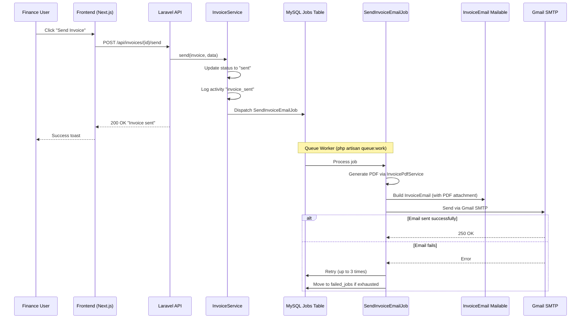

# Technical Design: Tech Stack Update — Redis to Laravel Jobs (MySQL), SMTP Gmail Email & Invoice PDF

## 1. Architectural Overview

The tech stack update modifies four foundational layers of the Accounting Timedoor application:

1. **Database layer** — Switch the canonical database from SQLite to MySQL. This is a configuration-only change; all existing Eloquent models and migrations are database-agnostic.
2. **Queue layer** — Confirm and formalize MySQL-backed `database` driver as the canonical queue backend, and remove all Redis references from configuration.
3. **Mail layer** — Switch from `log` driver to Gmail SMTP and implement asynchronous invoice email sending via a Laravel Job + Mailable.
4. **PDF layer** — Implement invoice PDF generation using `barryvdh/laravel-dompdf` and attach the PDF to outgoing invoice emails.

The existing codebase already has:
- A `database` queue connection configured in `config/queue.php` (default).
- Migrations for `jobs`, `job_batches`, and `failed_jobs` tables (`0001_01_01_000002_create_jobs_table.php`).
- A TODO placeholder in `InvoiceService::send()` for `SendInvoiceEmailJob::dispatch($invoice, $data)`.
- A fully functional send-invoice flow on both backend (`POST /api/invoices/{invoice}/send`) and frontend (`SendInvoiceModal.tsx`).
- A `GET /api/invoices/{invoice}/pdf` route already defined (returns 501 TODO).
- A rich `InvoicePrintView.tsx` frontend component (the blueprint for the PDF Blade template).
- A `config/invoice.php` with component registry, multi-locale labels (en/id/ja), and currency-locale map.
- An `InvoiceTemplate` model with per-customer component toggles.

No new database tables or frontend components are required. The changes are:
- Configuration updates (`.env.example`, `config/database.php`, `config/queue.php`).
- New composer dependency (`barryvdh/laravel-dompdf`).
- New backend classes (`SendInvoiceEmailJob`, `InvoiceEmail` Mailable, `InvoicePdfService`).
- New Blade templates (`pdf/invoice.blade.php`, `emails/invoice.blade.php`).
- Wiring the job dispatch into the existing `InvoiceService::send()` method.
- Implementing the `downloadPdf` endpoint in `InvoiceController`.
- Steering document updates (`tech.md`).

### Updated Architecture

```
┌─────────────────────────────────────────────────────────────┐
│                        Frontend                             │
│   Next.js 16 + React 19 + TypeScript + Tailwind + shadcn   │
└─────────────────────────────────────────────────────────────┘
                              │
                              │ REST API (JSON)
                              ▼
┌─────────────────────────────────────────────────────────────┐
│                         Backend                             │
│            Laravel 12 + PHP 8.2 + Sanctum Auth             │
│                                                             │
│   ┌───────────────┐    ┌──────────────────────────┐        │
│   │ InvoiceService│───▶│ SendInvoiceEmailJob      │        │
│   └───────┬───────┘    │ (queued, MySQL-backed)   │        │
│           │            └──────────┬───────────────┘        │
│           │                       │                         │
│           ▼                       ▼                         │
│   ┌───────────────┐    ┌──────────────────────────┐        │
│   │InvoicePdfSvc  │    │ InvoiceEmail (Mailable)  │        │
│   │(barryvdh/     │───▶│ + PDF attachment          │        │
│   │ laravel-dompdf│    │ ──▶ SMTP Gmail           │        │
│   └───────────────┘    └──────────────────────────┘        │
└─────────────────────────────────────────────────────────────┘
                              │
                              ▼
┌─────────────────────────────────────────────────────────────┐
│                        Database                             │
│                         MySQL                               │
│                                                             │
│   ┌────────────┐  ┌──────────┐  ┌──────────────────┐      │
│   │   jobs     │  │ cache    │  │ Application data │      │
│   │ failed_jobs│  │          │  │ (invoices, etc.) │      │
│   └────────────┘  └──────────┘  └──────────────────┘      │
└─────────────────────────────────────────────────────────────┘
```

---

## 2. Data Flow Diagram



---

## 3. Component & Interface Definitions

### 3.1 `SendInvoiceEmailJob` — [NEW]

**File:** `backend/app/Jobs/SendInvoiceEmailJob.php`

A queued Laravel Job that dispatches the `InvoiceEmail` Mailable. Implements `ShouldQueue` and uses the `database` queue connection.

```php
<?php

namespace App\Jobs;

use App\Mail\InvoiceEmail;
use App\Models\Invoice;
use Illuminate\Contracts\Queue\ShouldQueue;
use Illuminate\Foundation\Queue\Queueable;
use Illuminate\Support\Facades\Mail;

class SendInvoiceEmailJob implements ShouldQueue
{
    use Queueable;

    /**
     * Maximum retry attempts before marking as failed.
     */
    public int $tries = 3;

    /**
     * Backoff intervals in seconds between retries.
     */
    public array $backoff = [10, 60, 300];

    public function __construct(
        public Invoice $invoice,
        public string $recipientEmail,
        public string $subject,
        public ?string $messageBody = null,
    ) {}

    public function handle(): void
    {
        Mail::to($this->recipientEmail)
            ->send(new InvoiceEmail(
                invoice: $this->invoice,
                subject: $this->subject,
                messageBody: $this->messageBody,
            ));
    }
}
```

### 3.2 `InvoicePdfService` — [NEW]

**File:** `backend/app/Services/InvoicePdfService.php`

A service class that generates invoice PDFs using `barryvdh/laravel-dompdf`. It resolves the customer's invoice template components and locale labels from `config/invoice.php`, then renders the `pdf.invoice` Blade view to PDF.

```php
<?php

namespace App\Services;

use App\Models\Invoice;
use App\Models\InvoiceTemplate;
use Barryvdh\DomPDF\Facade\Pdf;

class InvoicePdfService
{
    /**
     * Generate a PDF for the given invoice.
     *
     * @return \Barryvdh\DomPDF\PDF
     */
    public function generate(Invoice $invoice)
    {
        $invoice->load(['items', 'customer']);

        // Resolve the customer's invoice template (or use defaults)
        $template = InvoiceTemplate::where('customer_id', $invoice->customer_id)->first();
        $components = $template
            ? $template->components
            : config('invoice.default_components');

        // Resolve locale labels based on currency
        $currency = $invoice->currency ?? 'IDR';
        $localeMap = config('invoice.currency_locale_map');
        $language = $localeMap[$currency]['language'] ?? 'en';
        $labels = config("invoice.labels.{$language}", config('invoice.labels.en'));

        $data = [
            'invoice' => $invoice,
            'components' => $components,
            'labels' => $labels,
            'language' => $language,
        ];

        return Pdf::loadView('pdf.invoice', $data)
            ->setPaper('a4', 'portrait');
    }

    /**
     * Generate PDF and return raw content as string.
     */
    public function generateRaw(Invoice $invoice): string
    {
        return $this->generate($invoice)->output();
    }
}
```

### 3.3 `InvoiceEmail` — [NEW]

**File:** `backend/app/Mail/InvoiceEmail.php`

A Laravel Mailable class that constructs the invoice email with subject, body text, and the invoice PDF as an attachment.

```php
<?php

namespace App\Mail;

use App\Models\Invoice;
use App\Services\InvoicePdfService;
use Illuminate\Bus\Queueable;
use Illuminate\Mail\Attachment;
use Illuminate\Mail\Mailable;
use Illuminate\Mail\Mailables\Content;
use Illuminate\Mail\Mailables\Envelope;
use Illuminate\Queue\SerializesModels;

class InvoiceEmail extends Mailable
{
    use Queueable, SerializesModels;

    public function __construct(
        public Invoice $invoice,
        public string $subject,
        public ?string $messageBody = null,
    ) {}

    public function envelope(): Envelope
    {
        return new Envelope(subject: $this->subject);
    }

    public function content(): Content
    {
        return new Content(
            markdown: 'emails.invoice',
            with: [
                'invoice' => $this->invoice->load(['items', 'customer']),
                'messageBody' => $this->messageBody,
            ],
        );
    }

    public function attachments(): array
    {
        $pdfService = app(InvoicePdfService::class);
        $pdfContent = $pdfService->generateRaw($this->invoice);
        $filename = "Invoice-{$this->invoice->invoice_number}.pdf";

        return [
            Attachment::fromData(fn () => $pdfContent, $filename)
                ->withMime('application/pdf'),
        ];
    }
}
```

### 3.4 Invoice Email Blade Template — [NEW]

**File:** `backend/resources/views/emails/invoice.blade.php`

A Markdown email template using Laravel's built-in Markdown mail components. The actual invoice details are in the PDF attachment — the email body is kept simple.

```blade
<x-mail::message>
@if($messageBody)
{{ $messageBody }}
@endif

**Invoice #:** {{ $invoice->invoice_number }}
**Date:** {{ $invoice->invoice_date->format('Y-m-d') }}
@if($invoice->due_date)
**Due Date:** {{ $invoice->due_date->format('Y-m-d') }}
@endif
**Total:** {{ $invoice->currency }} {{ number_format($invoice->total, 2) }}

Please find the invoice attached as a PDF.

Thanks,<br>
{{ config('app.name') }}
</x-mail::message>
```

### 3.5 Invoice PDF Blade Template — [NEW]

**File:** `backend/resources/views/pdf/invoice.blade.php`

A standalone HTML template rendered to PDF via DomPDF. The layout mirrors the existing `InvoicePrintView.tsx` frontend component and uses `config/invoice.php` labels and component toggles.

```blade
<!DOCTYPE html>
<html lang="{{ $language }}">
<head>
    <meta charset="UTF-8">
    <style>
        * { margin: 0; padding: 0; box-sizing: border-box; }
        body { font-family: 'DejaVu Sans', sans-serif; font-size: 11px; color: #1f2937; }
        .page { padding: 24px 40px; }
        .header { display: flex; justify-content: space-between; align-items: flex-end; margin-bottom: 24px; }
        .brand-color { color: #10AF13; }
        .header-bar { background: #10AF13; color: #fff; padding: 6px 12px; font-weight: bold; font-size: 10px; display: inline-block; }
        .divider { height: 3px; background: #10AF13; margin-top: 4px; }
        .section { margin-bottom: 24px; }
        table.items { width: 100%; border-collapse: collapse; }
        table.items th { text-align: left; padding: 6px 8px; font-size: 10px; border-bottom: 2px solid #9ca3af; }
        table.items td { padding: 8px; border-bottom: 1px solid #e5e7eb; }
        .text-right { text-align: right; }
        .text-center { text-align: center; }
        .summary-box { border: 1px solid #d1d5db; overflow: hidden; }
        .summary-label { background: #FFF9C4; padding: 8px 12px; font-size: 10px; color: #6b7280; width: 120px; display: inline-block; }
        .summary-value { padding: 8px 16px; font-size: 20px; font-weight: bold; display: inline-block; }
        .grand-total-box { background: #FFF9C4; border: 1px solid #d1d5db; padding: 8px 16px; font-weight: bold; font-size: 16px; text-align: right; }
    </style>
</head>
<body>
<div class="page">
    {{-- Company Header --}}
    @if(collect($components)->firstWhere('key', 'company_header')['enabled'] ?? false)
    <div class="header">
        <div>
            <div style="font-size:28px;font-weight:800;color:#1B2A3D;">timedoor</div>
            <div class="brand-color" style="font-size:12px;font-weight:bold;letter-spacing:0.3em;">{{ $labels['invoice'] }}</div>
        </div>
        @if(collect($components)->firstWhere('key', 'invoice_meta')['enabled'] ?? false)
        <div>
            <span class="header-bar">{{ $invoice->invoice_date->format('Y-m-d') }}</span>
            <span class="header-bar" style="border-left:1px solid rgba(255,255,255,0.3);">{{ $labels['invoice_number'] }}: {{ $invoice->invoice_number }}</span>
        </div>
        @endif
    </div>
    <div class="divider"></div>
    @endif

    {{-- Customer + Sender Details --}}
    <div class="section" style="margin-top:24px;">
        <table style="width:100%;"><tr>
            @if(collect($components)->firstWhere('key', 'customer_details')['enabled'] ?? false)
            <td style="vertical-align:top;width:50%;">
                <div style="font-size:10px;color:#6b7280;">{{ $labels['to'] }}</div>
                <div style="font-weight:bold;font-size:14px;">{{ $invoice->customer->company_name ?? $invoice->customer->name }}</div>
            </td>
            @endif
            @if(collect($components)->firstWhere('key', 'sender_details')['enabled'] ?? false)
            <td style="vertical-align:top;width:50%;text-align:right;font-size:10px;color:#6b7280;">
                {{-- Sender details rendered here if available --}}
            </td>
            @endif
        </tr></table>
    </div>

    {{-- Total Summary Box --}}
    @if(collect($components)->firstWhere('key', 'total_summary_box')['enabled'] ?? false)
    <div class="section summary-box">
        <span class="summary-label">{{ $labels['amount_of_payment'] }}</span>
        <span class="summary-value">@formatCurrency($invoice->total, $invoice->currency)</span>
    </div>
    @endif

    {{-- Line Items Table --}}
    @if(collect($components)->firstWhere('key', 'line_items')['enabled'] ?? false)
    <div class="section">
        <table class="items">
            <thead>
                <tr>
                    <th>{{ $labels['description'] }}</th>
                    <th class="text-center" style="width:60px;">{{ $labels['qty'] }}</th>
                    <th class="text-right" style="width:120px;">{{ $labels['unit_price'] }}</th>
                    <th class="text-right" style="width:120px;">{{ $labels['price'] }}</th>
                </tr>
            </thead>
            <tbody>
                @foreach($invoice->items as $item)
                <tr>
                    <td>{{ $item->description }}</td>
                    <td class="text-center">{{ $item->quantity }}</td>
                    <td class="text-right">@formatCurrency($item->unit_price, $invoice->currency)</td>
                    <td class="text-right">@formatCurrency($item->amount, $invoice->currency)</td>
                </tr>
                @endforeach
            </tbody>
        </table>
    </div>
    @endif

    {{-- Bank Transfer + Grand Total --}}
    @if(collect($components)->firstWhere('key', 'grand_total')['enabled'] ?? false)
    <div style="text-align:right;margin-top:16px;">
        <div style="font-size:10px;color:#6b7280;">{{ $labels['total_sum'] }}</div>
        <div class="grand-total-box">@formatCurrency($invoice->total, $invoice->currency)</div>
    </div>
    @endif
</div>
</body>
</html>
```

> **Note:** The `@formatCurrency` directive will be registered in `AppServiceProvider` to handle currency formatting (JPY with period separators, IDR with period separators, USD/AUD with comma separators) matching the frontend `InvoicePrintView.tsx` logic.

### 3.6 `InvoiceService::send()` — [MODIFY]

**File:** `backend/app/Services/InvoiceService.php`

Replace the TODO comment with actual job dispatch:

```diff
     public function send(Invoice $invoice, array $data): void
     {
         // Update status to sent if draft
         if ($invoice->status === InvoiceStatus::Draft) {
             $invoice->update(['status' => InvoiceStatus::Sent]);
         }

         // Log the send activity
         $invoice->logActivity('invoice_sent', [
             'recipient' => $data['recipient_email'],
             'subject' => $data['subject'],
         ]);

-        // TODO: Dispatch job to send email
-        // SendInvoiceEmailJob::dispatch($invoice, $data);
+        SendInvoiceEmailJob::dispatch(
+            invoice: $invoice,
+            recipientEmail: $data['recipient_email'],
+            subject: $data['subject'],
+            messageBody: $data['message'] ?? null,
+        );
     }
```

### 3.7 `InvoiceService::sendReminder()` — [MODIFY]

**File:** `backend/app/Services/InvoiceService.php`

Replace the TODO comment with actual job dispatch (reuses `SendInvoiceEmailJob`):

```diff
     public function sendReminder(Invoice $invoice, array $data): void
     {
         $invoice->logActivity('reminder_sent', [
             'recipient' => $data['recipient_email'],
             'subject' => $data['subject'],
         ]);

-        // TODO: Dispatch job to send reminder email
-        // SendReminderEmailJob::dispatch($invoice, $data);
+        SendInvoiceEmailJob::dispatch(
+            invoice: $invoice,
+            recipientEmail: $data['recipient_email'],
+            subject: $data['subject'],
+            messageBody: $data['message'] ?? null,
+        );
     }
```

### 3.8 `InvoiceController::downloadPdf()` — [MODIFY]

**File:** `backend/app/Http/Controllers/InvoiceController.php`

Replace the 501 TODO with actual PDF generation and download:

```diff
     public function downloadPdf(Invoice $invoice)
     {
-        // TODO: Implement PDF generation
-        return response()->json([
-            'message' => 'PDF generation not yet implemented',
-        ], 501);
+        $pdfService = app(InvoicePdfService::class);
+        $pdf = $pdfService->generate($invoice);
+        $filename = "Invoice-{$invoice->invoice_number}.pdf";
+
+        return $pdf->download($filename);
     }
```

### 3.9 `AppServiceProvider` — [MODIFY]

**File:** `backend/app/Providers/AppServiceProvider.php`

Register the `@formatCurrency` Blade directive for use in the PDF template:

```php
use Illuminate\Support\Facades\Blade;

public function boot(): void
{
    Blade::directive('formatCurrency', function ($expression) {
        return "<?php echo app(\\App\\Services\\InvoicePdfService::class)->formatCurrency($expression); ?>";
    });
}
```

The `formatCurrency` static helper on `InvoicePdfService` mirrors the frontend logic:

```php
public static function formatCurrency(float $amount, string $currency): string
{
    return match ($currency) {
        'JPY' => '¥' . number_format($amount, 0, '.', '.'),
        'IDR' => 'IDR ' . number_format($amount, 0, '.', '.'),
        default => '$' . number_format($amount, 2, '.', ','),
    };
}
```

---

## 4. API Endpoint Definitions

No new API endpoints are required. The existing endpoints are modified:

| Method | Path | Purpose | Changes |
|--------|------|---------|---------|
| `POST` | `/api/invoices/{invoice}/send` | Send invoice to customer | Now dispatches a real email job with PDF attachment |
| `POST` | `/api/invoices/{invoice}/resend` | Resend invoice | Same as above |
| `POST` | `/api/invoices/{invoice}/send-reminder` | Send payment reminder | Now dispatches a real email job with PDF attachment |
| `GET` | `/api/invoices/{invoice}/pdf` | Download invoice PDF | **Implemented** — returns PDF download |

**Send Request body** (unchanged):
```json
{
  "recipient_email": "customer@example.com",
  "subject": "Invoice #INV-2026-001",
  "message": "Please find your invoice attached."
}
```

**Send Success response** (unchanged): `200 OK`
```json
{
  "message": "Invoice sent successfully"
}
```

**PDF Download response**: `200 OK`
- `Content-Type: application/pdf`
- `Content-Disposition: attachment; filename="Invoice-INV-2026-001.pdf"`

---

## 5. Configuration & Dependency Changes

### 5.1 New Composer Dependency

```bash
cd backend && composer require barryvdh/laravel-dompdf
```

This adds the `barryvdh/laravel-dompdf` package for HTML-to-PDF generation. No additional system dependencies required (uses the pure-PHP DomPDF engine).

### 5.2 `.env.example` — [MODIFY]

```diff
-DB_CONNECTION=sqlite
-# DB_HOST=127.0.0.1
-# DB_PORT=3306
-# DB_DATABASE=laravel
-# DB_USERNAME=root
-# DB_PASSWORD=
+DB_CONNECTION=mysql
+DB_HOST=127.0.0.1
+DB_PORT=3306
+DB_DATABASE=accounting_timedoor
+DB_USERNAME=root
+DB_PASSWORD=

 QUEUE_CONNECTION=database

 CACHE_STORE=database

-REDIS_CLIENT=phpredis
-REDIS_HOST=127.0.0.1
-REDIS_PASSWORD=null
-REDIS_PORT=6379

-MAIL_MAILER=log
-MAIL_SCHEME=null
-MAIL_HOST=127.0.0.1
-MAIL_PORT=2525
-MAIL_USERNAME=null
-MAIL_PASSWORD=null
-MAIL_FROM_ADDRESS="hello@example.com"
-MAIL_FROM_NAME="${APP_NAME}"
+# Gmail SMTP Configuration
+# To use Gmail SMTP, you must enable 2-Step Verification on your Google Account
+# and generate an App Password at https://myaccount.google.com/apppasswords
+MAIL_MAILER=smtp
+MAIL_HOST=smtp.gmail.com
+MAIL_PORT=587
+MAIL_USERNAME=your-email@gmail.com
+MAIL_PASSWORD=your-gmail-app-password
+MAIL_ENCRYPTION=tls
+MAIL_FROM_ADDRESS=your-email@gmail.com
+MAIL_FROM_NAME="${APP_NAME}"
```

### 5.3 `config/database.php` — [MODIFY]

Change the default `DB_CONNECTION` fallback from `sqlite` to `mysql` and remove the `redis` configuration block:

```diff
-    'default' => env('DB_CONNECTION', 'sqlite'),
+    'default' => env('DB_CONNECTION', 'mysql'),
```

Remove the entire `'redis' => [...]` block (lines 145-181) from the config.

### 5.4 `config/queue.php` — [MODIFY]

Update the batching and failed job defaults from `sqlite` to `mysql`:

```diff
     'batching' => [
-        'database' => env('DB_CONNECTION', 'sqlite'),
+        'database' => env('DB_CONNECTION', 'mysql'),
         'table' => 'job_batches',
     ],

     'failed' => [
         'driver' => env('QUEUE_FAILED_DRIVER', 'database-uuids'),
-        'database' => env('DB_CONNECTION', 'sqlite'),
+        'database' => env('DB_CONNECTION', 'mysql'),
         'table' => 'failed_jobs',
     ],
```

### 5.5 `config/mail.php` — [MODIFY]

Change the default mailer fallback from `log` to `smtp`:

```diff
-    'default' => env('MAIL_MAILER', 'log'),
+    'default' => env('MAIL_MAILER', 'smtp'),
```

---

## 6. Database Schema Changes

**No new migrations are required.**

The `jobs`, `job_batches`, and `failed_jobs` tables already exist in migration `0001_01_01_000002_create_jobs_table.php`. The `cache` table already exists in migration `0001_01_01_000001_create_cache_table.php`. These are standard Laravel migrations that work with both SQLite and MySQL.

The only action needed is to run `php artisan migrate` against the MySQL database to create all tables in the new MySQL instance.

---

## 7. Steering Document Update

### 7.1 `tech.md` — [MODIFY]

Update the architecture diagram, backend stack table, and add queue/email documentation:

**Architecture diagram:**
- Replace `SQLite / MySQL` with `MySQL` in the Database box.
- Add a `Queue / Email` layer showing MySQL Jobs and SMTP Gmail.

**Backend Stack table:**
- Change Database from `SQLite / MySQL` to `MySQL`.
- Add new rows for Queue, Mail, and PDF:

| Category | Technology | Version |
|----------|------------|---------|
| Database | MySQL | 8.x |
| Queue | Laravel Jobs (MySQL `database` driver) | - |
| Mail | SMTP (Gmail) | - |
| PDF | barryvdh/laravel-dompdf | Latest |

**Development Commands section — add:**

```bash
# Start queue worker
php artisan queue:work

# Retry failed jobs
php artisan queue:retry all
```

---

## 8. Security Considerations

| Risk | Severity | Mitigation |
|------|----------|------------|
| **Gmail App Password in .env** | High | App password stored only in `.env` (gitignored). `.env.example` contains placeholders only. Document that users must use Gmail App Passwords (not account passwords). |
| **Email injection via subject/message** | Medium | `SendInvoiceRequest` already validates `subject` (max 255 chars) and `message` (max 2000 chars). Laravel's Mailable escapes HTML by default in Markdown templates. |
| **Queue poisoning** | Low | The `database` queue driver stores serialized PHP objects. Only authenticated users (via Sanctum) can trigger job dispatch. No public queue endpoints. |
| **Rate limiting** | Medium | Gmail SMTP has sending limits (~500/day for free accounts). For production, consider upgrading to Google Workspace or a transactional email service. No code change needed now — this is a deployment concern. |
| **Retry storm** | Low | `SendInvoiceEmailJob` uses exponential backoff (`[10, 60, 300]` seconds) with max 3 retries. Failed jobs are recorded in `failed_jobs` for manual review. |
| **MySQL connection security** | Medium | Use strong passwords, restrict access to `127.0.0.1` only, and consider SSL for remote connections. The `config/database.php` already supports `MYSQL_ATTR_SSL_CA`. |
| **PDF generation resource usage** | Low | DomPDF runs in-process. For large invoices, memory usage is manageable. PDF is generated per-job in the queue worker, so it does not block HTTP requests. |

---

## 9. Test Strategy

### 9.1 Unit Tests

**`SendInvoiceEmailJobTest`** — [NEW] `tests/Unit/SendInvoiceEmailJobTest.php`

| Test Case | Description |
|-----------|-------------|
| `test_job_sends_email_via_mailable` | Mock `Mail::fake()`, dispatch the job synchronously, assert `InvoiceEmail` was sent to the correct recipient. |
| `test_job_retries_on_failure` | Assert `$tries = 3` and `$backoff` are correctly set. |
| `test_job_passes_correct_data_to_mailable` | Assert the Mailable receives the correct invoice, subject, and message body. |

**`InvoiceEmailTest`** — [NEW] `tests/Unit/InvoiceEmailTest.php`

| Test Case | Description |
|-----------|-------------|
| `test_mailable_has_correct_subject` | Assert the envelope subject matches the provided subject. |
| `test_mailable_renders_invoice_data` | Assert the rendered content contains the invoice number, customer name, and total. |
| `test_mailable_includes_message_body` | Assert the rendered content includes the custom message when provided. |
| `test_mailable_handles_null_message_body` | Assert the rendered content gracefully handles a null message. |
| `test_mailable_has_pdf_attachment` | Assert `InvoiceEmail` has a PDF attachment named `Invoice-{number}.pdf`. |

**`InvoicePdfServiceTest`** — [NEW] `tests/Unit/InvoicePdfServiceTest.php`

| Test Case | Description |
|-----------|-------------|
| `test_generate_returns_pdf_instance` | Assert `generate()` returns a `\Barryvdh\DomPDF\PDF` instance. |
| `test_generate_raw_returns_string` | Assert `generateRaw()` returns a non-empty string starting with `%PDF`. |
| `test_format_currency_idr` | Assert IDR amounts use period separator (e.g., `IDR 1.000.000`). |
| `test_format_currency_jpy` | Assert JPY amounts use period separator with yen symbol (e.g., `¥1.000`). |
| `test_format_currency_usd` | Assert USD amounts use comma separator with dollar symbol (e.g., `$1,000.00`). |
| `test_uses_customer_template_components` | Assert the service loads the customer's `InvoiceTemplate` components. |
| `test_falls_back_to_default_components` | Assert the service uses `config('invoice.default_components')` when no template exists. |

### 9.2 Integration / Feature Tests

**`InvoiceControllerTest`** — [MODIFY] `tests/Feature/Http/Controllers/InvoiceControllerTest.php`

| Test Case | Description |
|-----------|-------------|
| `test_send_dispatches_email_job` | Use `Queue::fake()`, send a POST to `/api/invoices/{id}/send`, assert `SendInvoiceEmailJob` was dispatched with the correct payload. |
| `test_resend_dispatches_email_job` | Same as above for the `/resend` endpoint. |
| `test_send_reminder_dispatches_email_job` | Same as above for the `/send-reminder` endpoint. |
| `test_download_pdf_returns_pdf_response` | Call `GET /api/invoices/{id}/pdf`, assert response is 200 with content-type `application/pdf`. |

### 9.3 Configuration & Manual Verification

These are manual verification steps:

| Step | Action | Expected Outcome |
|------|--------|-----------------|
| 1 | Set `DB_CONNECTION=mysql` in `.env` with valid MySQL credentials | `php artisan migrate` runs all 16 migrations successfully |
| 2 | Run `php artisan queue:work --once` | Worker starts and listens for jobs from the `jobs` table |
| 3 | Trigger "Send Invoice" from the UI | Job appears in the `jobs` table, email is delivered via Gmail SMTP with PDF attachment |
| 4 | Open the received email | Verify the PDF attachment (`Invoice-INV-XXXX.pdf`) is present and opens correctly |
| 5 | Call `GET /api/invoices/{id}/pdf` directly | Browser downloads a PDF file with the correct invoice content |
| 6 | Check `.env.example` | No `REDIS_*` variables present; MySQL is default; Gmail SMTP is configured |
| 7 | Run `php artisan test` | All existing + new tests pass |

### Run commands

```bash
# Run all tests
cd backend && php artisan test

# Run only new tests
cd backend && php artisan test --filter=SendInvoiceEmailJobTest
cd backend && php artisan test --filter=InvoiceEmailTest
cd backend && php artisan test --filter=InvoicePdfServiceTest
cd backend && php artisan test --filter=InvoiceControllerTest
```
