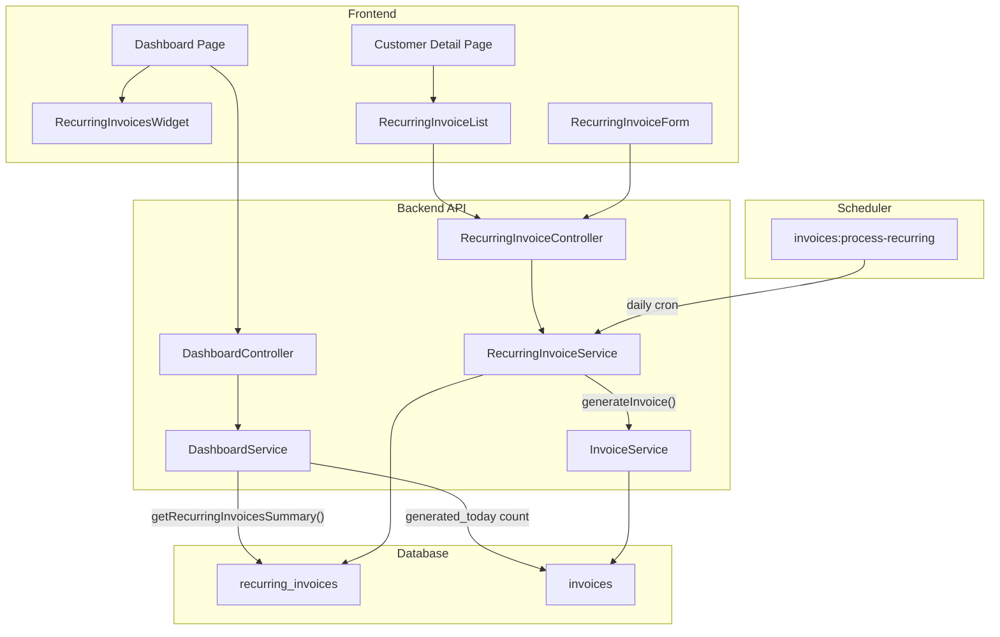
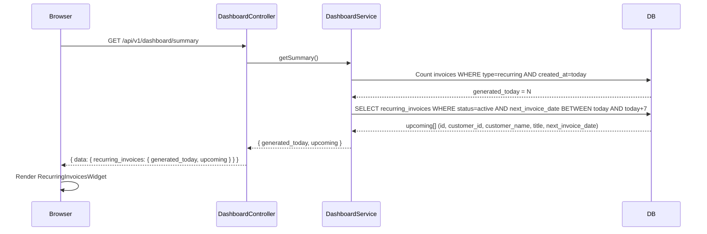
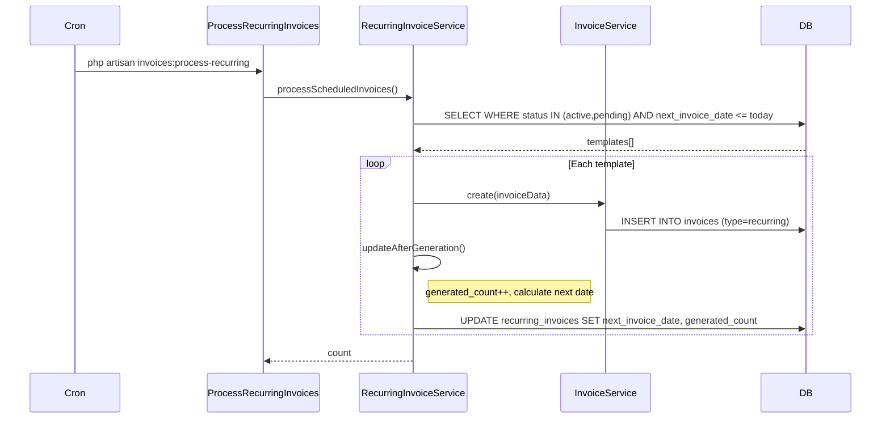
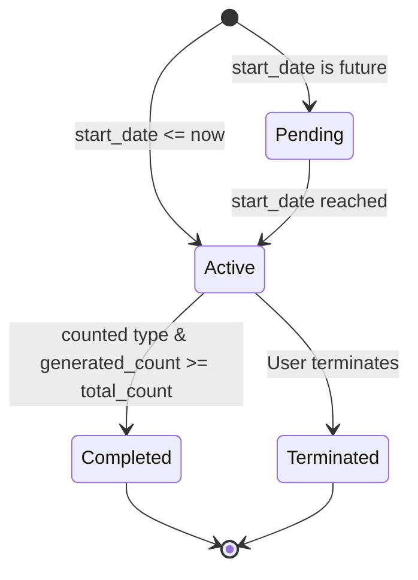

# Recurring Invoice System — Walkthrough

## Architecture Overview

---

## Dashboard Recurring Flow

The dashboard's **Recurring Invoices** card is a **read-only summary**. It does NOT manage recurring invoices — it only displays two metrics:

### Data Flow

### What Each Metric Shows

| Metric | Source | Description |
|---|---|---|
| **Generated Today** | `invoices` table | Count of invoices with `type=recurring` created today |
| **Upcoming (7 Days)** | `recurring_invoices` table | Active, non-manual templates with `next_invoice_date` within 7 days |

> [!IMPORTANT]
> The dashboard widget **does not auto-refresh** after editing recurring invoices. It fetches data once when the dashboard loads. To see changes, **reload the dashboard page** or navigate away and back.

### Why "Nothing Changes" on Dashboard

The dashboard reads from two independent data sources:

1. **`generated_today`** — only increments when `invoices:process-recurring` runs (or manual generate is used)
2. **`upcoming`** — filters by `next_invoice_date` and `status=active`. If a recurring invoice's `next_invoice_date` is outside the 7-day window or its status is not `active`, it won't appear.

Editing a recurring invoice's title, line items, or tax rate **does not change** `next_invoice_date` or `status`, so the dashboard card looks the same.

---

## Recurring Invoice CRUD Flow

### Key Files

| Layer | File | Purpose |
|---|---|---|
| **API Route** | [api.php](file:///Users/kevin/Documents/Projects/internal/accounting_timedoor/backend/routes/api.php) | `apiResource('recurring-invoices')` + custom `generate` route |
| **Controller** | [RecurringInvoiceController.php](file:///Users/kevin/Documents/Projects/internal/accounting_timedoor/backend/app/Http/Controllers/RecurringInvoiceController.php) | CRUD + manual generation endpoint |
| **Service** | [RecurringInvoiceService.php](file:///Users/kevin/Documents/Projects/internal/accounting_timedoor/backend/app/Services/RecurringInvoiceService.php) | Business logic: create, update, generateInvoice, calculateNextDate |
| **Resource** | [RecurringInvoiceResource.php](file:///Users/kevin/Documents/Projects/internal/accounting_timedoor/backend/app/Http/Resources/RecurringInvoiceResource.php) | JSON response formatting |
| **Model** | [RecurringInvoice.php](file:///Users/kevin/Documents/Projects/internal/accounting_timedoor/backend/app/Models/RecurringInvoice.php) | Eloquent model, `line_items` stored as JSON |
| **Frontend Form** | [RecurringInvoiceForm.tsx](file:///Users/kevin/Documents/Projects/internal/accounting_timedoor/frontend/components/recurring/RecurringInvoiceForm.tsx) | Create/Edit form |
| **Frontend List** | [RecurringInvoiceList.tsx](file:///Users/kevin/Documents/Projects/internal/accounting_timedoor/frontend/components/recurring/RecurringInvoiceList.tsx) | Table on customer detail page |
| **Frontend Hooks** | [useRecurringInvoices.ts](file:///Users/kevin/Documents/Projects/internal/accounting_timedoor/frontend/lib/hooks/useRecurringInvoices.ts) | React Query hooks |
| **Frontend API** | [recurring-invoices.ts](file:///Users/kevin/Documents/Projects/internal/accounting_timedoor/frontend/lib/api/recurring-invoices.ts) | API client functions |

### API Endpoints

| Method | Endpoint | Action |
|---|---|---|
| `GET` | `/customers/{id}/recurring-invoices` | List all for a customer |
| `POST` | `/recurring-invoices` | Create new template |
| `GET` | `/recurring-invoices/{id}` | Get single template |
| `PUT` | `/recurring-invoices/{id}` | Update template |
| `DELETE` | `/recurring-invoices/{id}` | Terminate template |
| `POST` | `/recurring-invoices/{id}/generate` | Manually generate an invoice |

---

## Invoice Generation Flow

### Status Lifecycle

### Recurrence Types

| Type | Behavior |
|---|---|
| **Monthly** | Every N months from start |
| **Weekly** | Every N weeks from start |
| **Bi-Weekly** | Every 2 weeks |
| **Tri-Weekly** | Every 3 weeks |
| **Counted** | Custom interval+unit, stops after `total_count` |
| **Manual** | No auto-generation, user clicks "Run Now" |

---

## Bug Fixes Applied

| Issue | Root Cause | Fix |
|---|---|---|
| Invoice list always shows IDR | `InvoiceCollection` missing `currency` field | Added `currency` and `type` to [InvoiceCollection.php](file:///Users/kevin/Documents/Projects/internal/accounting_timedoor/backend/app/Http/Resources/InvoiceCollection.php) |
| Recurring edit form empty | `response()->json(new Resource)` skips `data` wrapper | Wrapped in `['data' => new Resource]` in [RecurringInvoiceController.php](file:///Users/kevin/Documents/Projects/internal/accounting_timedoor/backend/app/Http/Controllers/RecurringInvoiceController.php) |
| Line items layout broken | `Input` component wrapper div breaks grid `col-span` | Wrapped inputs in `
` in [RecurringInvoiceForm.tsx](file:///Users/kevin/Documents/Projects/internal/accounting_timedoor/frontend/components/recurring/RecurringInvoiceForm.tsx) |
| Dashboard "View" link 404 | Link pointed to `/recurring-invoices/{id}` (no page) | Fixed to `/customers/{customer_id}/recurring/{id}/edit` in [RecurringInvoicesWidget.tsx](file:///Users/kevin/Documents/Projects/internal/accounting_timedoor/frontend/components/dashboard/RecurringInvoicesWidget.tsx) |
| Missing Tax Rate field | Form didn't include tax_rate input | Added Tax Rate input to [RecurringInvoiceForm.tsx](file:///Users/kevin/Documents/Projects/internal/accounting_timedoor/frontend/components/recurring/RecurringInvoiceForm.tsx) |
| `due_date` validation error | Backend required `due_date`, frontend allowed null | Made nullable in [StoreInvoiceRequest.php](file:///Users/kevin/Documents/Projects/internal/accounting_timedoor/backend/app/Http/Requests/Invoice/StoreInvoiceRequest.php) and [UpdateInvoiceRequest.php](file:///Users/kevin/Documents/Projects/internal/accounting_timedoor/backend/app/Http/Requests/Invoice/UpdateInvoiceRequest.php) |
